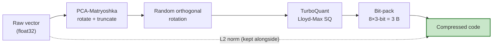

# TurboQuant Pro

[](https://pypi.org/project/turboquant-pro/)
[](https://pepy.tech/project/turboquant-pro)
[](https://pypi.org/project/turboquant-pro/)
[](https://github.com/ahb-sjsu/turboquant-pro/actions)
[](LICENSE)
[](https://doi.org/10.5281/zenodo.20660087)

**Consumer-aware compression for embedding indexes and LLM KV caches.** TurboQuant Pro compresses each vector by the metric its downstream consumer actually uses — retrieval recall for indexes, attention/generation quality for KV caches — **not reconstruction cosine alone**, which is repeatedly shown here to be blind, or even anti-correlated, with quality.

```bash
pip install turboquant-pro
tqp replay embedding_glove_recall --small   # reproduce the headline retrieval claim — CI-gated, runs in seconds
```

- **Embedding retrieval:** **32× compression at recall@10 0.9992** (after matched reranking, on real LaBSE/Gutenberg data) — outperforms RaBitQ and ties OPQ under a matched-byte public benchmark protocol, at **4–20× lower index-build cost**.
- **KV caches:** architecture-aware **key** quantization avoids a failure that is invisible to reconstruction metrics — PolarQuant keys read 0.995 cosine yet blow perplexity to ≈10⁴; per-channel keys keep it near fp16.
- **At scale & in production:** compressed-domain search, persisted / **larger-than-RAM** sharded + memory-mapped indexes, distribution-free rank **certificates**, one-command **replay**, and drift **monitoring**.

> Every headline number — with its reproduction status, dataset, one-click notebook, and hardware — is a row in **[`CLAIMS.md`](CLAIMS.md)**. The acceptance signal everywhere is rank fidelity / a certificate / the consumer's metric — **never reconstruction cosine.**

The current release is **1.9.0** (larger-than-RAM search + index format v3); the `tqp` CLI and certification platform shipped in 1.8.0. Full notes: [`CHANGELOG.md`](CHANGELOG.md).

## Installation

```bash
pip install turboquant-pro          # core (numpy only) + the `tqp` CLI
pip install turboquant-pro[torch]   # + operator tracer (`tqp trace`)
pip install turboquant-pro[fast]    # + AVX2 ADC kernel (pybind11)
pip install turboquant-pro[gpu]     # + CuPy CUDA 12.x
pip install turboquant-pro[all]     # everything (pgvector, FAISS, NATS, …)
```

## 30-second embedding compression

The central, best-validated contribution — compress a corpus and search the codes directly:

```python
from turboquant_pro import PCAMatryoshka, ADCIndex

pca = PCAMatryoshka(input_dim=768, output_dim=256).fit(train_vectors)
pipeline = pca.with_quantizer(bits=3)                 # PCA rotate/truncate + 3-bit TurboQuant
index = ADCIndex(pipeline).add(corpus)                # compressed-domain index (~63 B/vec)

ids, scores = index.search(queries, k=10)                          # single-pass, fast
ids, scores = index.search(queries, k=10, rerank=5, originals=corpus)   # exact rerank → ~0.9997
```

`PCAMatryoshka.suggest_output_dim(corpus, target_variance=0.95)` picks the truncation dim from the data's spectrum. See the [user guide](docs/guides/user_guide.md).

## Or compress an LLM KV cache

Architecture-aware by quantizer, not just bit-width — per-channel **keys** + PolarQuant **values**:

```python
from turboquant_pro import TurboQuantKVCache

cache = TurboQuantKVCache.robust(head_dim=128, n_heads=32, hot_window=512)  # asym-NF4 keys + 2% outliers, 4-bit K/V
# or auto-configure from a model name:
from turboquant_pro import AutoConfig
cache = AutoConfig.from_pretrained("llama-3-8b", target="balanced").build_cache()   # K4/V3
```

`robust()` is one codebook that stays near-fp16 across every architecture tested (including high-GQA models where symmetric NF4 silently collapses). See the [KV keys finding](docs/KV_KEYS_FINDING.md).

## Choose your workflow

| Goal | Start here |
|---|---|
| Compress a vector index and search it | [User guide](docs/guides/user_guide.md) · [fast ADC design](docs/DESIGN_fast_adc.md) |
| Keep an index larger than RAM (memmap / shards) | [Production lifecycle](docs/guides/production_lifecycle.md) |
| Compress an LLM KV cache correctly | [KV keys finding](docs/KV_KEYS_FINDING.md) · [operator-aware quantization](docs/guides/operator_aware_quantization.md) |
| Compress model weights | [Model-weight guide](docs/guides/model_weight_compression.md) |
| Certify & third-party-verify a deployment | [Certification](docs/guides/certification.md) |
| Reproduce a headline number yourself | [`CLAIMS.md`](CLAIMS.md) · [claim replay](docs/guides/claim_replay.md) |
| Integrate (pgvector, FAISS, NATS, vLLM, …) | [Integrations](docs/integrations.md) |

## Why consumer-aware compression?

One governing principle ties the whole toolkit together:

> **Compress a tensor by the metric its consumer uses. Accept or reject on that metric — recall, perplexity, a rank certificate, an expert-set flip rate — never reconstruction cosine on its own.**

The sharpest illustration is KV-cache **keys**. PolarQuant normalizes each key and quantizes its *direction*, discarding the per-channel scale that `softmax(Q·Kᵀ)` depends on. On Qwen2.5 that reads a reassuring **0.995 key cosine** while perplexity explodes to **≈10⁴**; per-channel key quantization at the same width keeps it near fp16 (≈15). A reconstruction-only benchmark cannot see this. Full write-up: [`docs/KV_KEYS_FINDING.md`](docs/KV_KEYS_FINDING.md).

That boundary is now instrumented, so the principle ships as tooling rather than advice:

- **`rank_certificate`** — turns a measured distortion κ + the corpus's distance-ratio concentration μ̂ into a **distribution-free** rank floor (Kendall τ ≥ 1−2μ̂); a vacuous floor is the per-corpus "exact reranking required" signal. Emit with `tqp certify`, re-check with `tqp verify` (a third party re-hashes the inputs and reproduces the math).
- **`a2_probe`** — selects the quantizer family against the *declared* consumer (cosine / L2 / attention logits) at calibration time; it reproduces the keys catastrophe as a unit test.
- **`operator_trace` / `operator_sensitivity`** — infer each tensor's consumer (softmax score / residual / MoE gate / SSM decay) and apply the discipline that operator needs, validated on real Mixtral, OLMoE, and Mamba models.

Backed by the companion theory papers: [the-angular-observer](https://github.com/ahb-sjsu/the-angular-observer) (the rank-certificate and (A2) transfer theory) and [geometric-observation](https://github.com/ahb-sjsu/geometric-observation) — the evidence repository home of **Paper III** (Observation Theory: consumer-relative rate–distortion and the omission floor) and **Paper IV** (the consumer-relative flip). TurboQuant Pro is *Paper II* of that series, the compression-as-observation work.

### The strategic bet

As models and vector databases scale, the binding constraint shifts from *storing the vector* to *preserving what its consumer reads with it*. Reconstruction fidelity — the objective essentially every quantizer optimizes — is increasingly the wrong one: it can show a reassuring 0.995 cosine while the downstream task collapses. TurboQuant Pro is the production embodiment of the alternative: **measure the consumer's read operator, spend bits against it, and ship a certificate that the ranking survives** — turning a theory program (Paper I's transfer/rank theory, Paper IV's consumer-relative flip) into instruments you run in CI. The bet is that *certified, consumer-aware compression* becomes table stakes as ratios climb and silent quality regressions get more expensive to miss. That is the axis this project competes on — not one more point on the compression-vs-reconstruction curve, but the certificate that the compression preserved the thing that mattered.

## How it works

A per-vector flow — extract L2 norm → unit-normalize → random-orthogonal rotate → Lloyd-Max scalar-quantize → bit-pack — compresses embeddings and KV-cache *values* near-losslessly (the **TurboQuant** algorithm, Zandieh et al., ICLR 2026). KV-cache **keys** take the per-channel path instead (above).



## Benchmark snapshot

At **32× compression**, recall@10 on real LaBSE / multilingual-Gutenberg embeddings — all methods reranked identically:

| method | recall@10 (single) | recall@10 (+rerank) | index build |
|---|---:|---:|---:|
| PQ | 0.467 | 0.827 | 142 s |
| RaBitQ (2024 SOTA) | 0.630 | 0.962 | 0.3 s |
| OPQ | 0.780 | 0.999 | 632 s |
| **turboquant-pro** | **0.784** | **0.9992** | **31 s** |

Holds at 1M scale (0.989 +rerank, tying OPQ). **Full tables** — the 15-method BGE-M3 comparison, the rerank frontier, KV-cache generation quality & memory, the RaBitQ estimator-isolated head-to-head — are in [**docs/benchmarks/embeddings.md**](docs/benchmarks/embeddings.md) and [**docs/benchmarks/kv.md**](docs/benchmarks/kv.md). Reproduce end-to-end on public data: [`notebooks/turboquant_benchmark.ipynb`](notebooks/turboquant_benchmark.ipynb) · [Colab](https://colab.research.google.com/github/ahb-sjsu/turboquant-pro/blob/master/notebooks/turboquant_benchmark.ipynb).

> **Reading compression ratios.** Ratios vary with source dimension, PCA truncation, code width, retained metadata, and whether exact originals are kept for reranking — so distinguish *compressed payload* vs *all-in index storage* vs *full retrieval-pipeline storage*. The canonical headline is **32× at recall@10 0.9992** above; other figures in the benchmark docs (e.g. 27.7× single-vector, 114× pipeline-storage) are labeled by their accounting basis.

## At scale & in production

**Larger-than-RAM search (1.9.0).** `TQEIndex` persists an index and memory-maps it; a block-streamed path keeps peak RAM at `O(n_queries × block)` at any corpus size. `ShardedIndex` splits a corpus into shards that **share one PCA basis** (scores stay comparable) behind a JSON manifest and fans search across them (parallel across cores; `distributed.py` partitions shards across machines). On disk, **index format v3** bit-packs sub-byte codes — a *lossless* re-encoding (rankings bit-identical to v2) at **24.1 B/row** vs 41 B/row in v2 (2M rows / 4-bit / `--no-originals`).

```python
from turboquant_pro import TQEIndex, ShardedIndex

idx = TQEIndex.open("index.tqe", mmap=True)                 # memory-mapped, read/search only
ids, scores = idx.search(queries, k=10, block=100_000)      # bounded-RAM, block-streamed

ShardedIndex.create(corpus, "shards/", shard_size=500_000, bits=3)   # one shared PCA basis
ids, scores = ShardedIndex.open("shards/manifest.json").search(queries, k=10)
```

**The `tqp` CLI** covers the whole lifecycle — `trace → plan → compress → certify → verify → replay → monitor`, plus a persisted-index workflow:

```bash
tqp plan embeddings --embeddings corpus.npy --target "recall@10 >= 0.90"    # recipe on the Pareto frontier
tqp certify --original corpus.npy --reconstructed corpus_q.npy --min-tau 0.8 \
  --task "recall@10 >= 0.995" --environment --html report.html              # rank floor + provenance envelope
tqp verify certificate.json --original corpus.npy --reconstructed corpus_q.npy   # a third party re-checks it
tqp index create --embeddings corpus.npy --out shards/ --bits 3 --shard-size 500000
tqp index search shards/manifest.json --queries q.npy --k 10 --mmap --block 100000
```

Full command reference: [`docs/CLI.md`](docs/CLI.md). Also here: `QualityMonitor` (cosine + (A2) tangential drift, Prometheus metrics), `behavioral_agreement` (decision-level flip rate + noise floor), hardware-aware profiles (Volta→Blackwell), a portable Triton fused-decode kernel, and cross-framework export (FAISS / Milvus / Qdrant / Weaviate / Pinecone) — see [Integrations](docs/integrations.md).

## Feature & stability matrix

The full table is in [`docs/api-stability.md`](docs/api-stability.md) (the source of truth); component reference in [`docs/API.md`](docs/API.md).

| Tier | Components |
|---|---|
| **Stable** | `PCAMatryoshka`, embedding compression pipeline, basic `TurboQuantKV`, TQE1 format |
| **Beta** | `ADCIndex`, `TQEIndex` (memmap + format v3), `ShardedIndex`, `TurboQuantKVCache`, the rank certificate (`tqp certify`/`verify`), the (A2) probe + quality monitor, the `tqp index` lifecycle, the runtime safe-fallback policy, FAISS / pgvector wrappers |
| **Experimental** | quantizer plugin registry + conformance kit, CUDA/Triton fused decode, multi-node shard server (`distributed.py`), vLLM manager, model-weight compressor, PostgreSQL extension, NATS transport |

**Scope & honesty:** results are strongest on **text embeddings and LLM workloads**; multimodal APIs/presets exist but are less validated. "Beats RaBitQ" means under our matched-byte public protocol; "robust across every architecture" means every architecture *tested*. All 4-bit KV quant (asym-NF4 included) still degrades on very-long-generation tasks. Negative results and caveats are kept first-class in [`docs/claims.md`](docs/claims.md) and the [soundness audit](docs/soundness_audit.md).

> **Not to be confused with** the similarly-named `turboquant` (the HuggingFace KV-cache implementation of the original ICLR TurboQuant algorithm). TurboQuant Pro is a broader, retrieval-first platform that uses that quantizer as **one component**.

## Documentation & reproducibility

- **[Documentation hub](docs/)** — guides, reference, and the 15-minute reviewer path.
- **Reproduce the claims:** [`CLAIMS.md`](CLAIMS.md) (claim → notebook → hardware → status) · [claim replay guide](docs/guides/claim_replay.md) · [evidence ladder](docs/claims.md).
- **Benchmarks:** [embeddings](docs/benchmarks/embeddings.md) · [KV cache](docs/benchmarks/kv.md) · [release/library growth](docs/RELEASE_HISTORY.md).
- **Formats:** [FORMATS.md](docs/FORMATS.md) (TQE1 / TQIX / certificates at a glance) · [FORMAT_SPEC.md](docs/FORMAT_SPEC.md) · [CERTIFICATE_SPEC.md](docs/CERTIFICATE_SPEC.md).
- **Citation:** [`CITATION.cff`](CITATION.cff) (GitHub "Cite this repository") · full BibTeX + acknowledgments in [`docs/CITATION.md`](docs/CITATION.md).

## License

MIT License. See [LICENSE](LICENSE). Author: **Andrew H. Bond**, San Jose State University.
