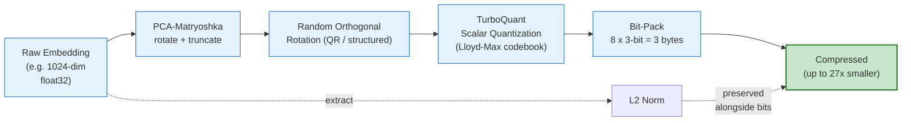
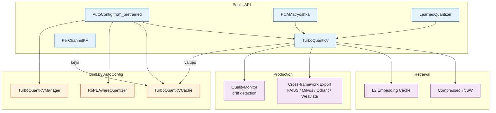

# TurboQuant Pro

[](https://pypi.org/project/turboquant-pro/)
[](https://pepy.tech/project/turboquant-pro)
[](https://pypi.org/project/turboquant-pro/)
[](https://github.com/ahb-sjsu/turboquant-pro/actions)
[](https://github.com/psf/black)
[](https://github.com/astral-sh/ruff)
[](LICENSE)
[](https://doi.org/10.5281/zenodo.20660087)

**PCA-Matryoshka dimension reduction + TurboQuant scalar quantization for embedding compression, LLM KV caches, model weight pruning, pgvector, FAISS, and NATS transport.**

Up to 27× embedding compression at 99.8% recall@10 (with 5× oversampling + reranking — all methods benchmarked identically). At ~30× compression turboquant-pro beats the 2024 SOTA (RaBitQ) on recall and ties OPQ at 1M-vector scale, while building the index 4–20× faster. Learned codebooks reduce quantization error 22%. Multi-modal (text, vision, audio, code), production observability, runs on consumer GPUs (Volta+) and CPU. **489 tests.**

> **Evaluate on the metric that matters.** Cosine similarity to the original vector is *not* a reliable proxy for downstream quality — for retrieval it diverges from recall at high compression, and for KV-cache **keys** it is actively misleading (see [v1.2.0 below](#highlights)). Always measure recall (retrieval) or perplexity (generation).

## Contents

- **Start here:** [Highlights](#highlights) · [Installation](#installation) · [Quick Start](#quick-start) · [How It Works](#how-it-works)
- **Features:** [Embedding compression](#embedding-compression) · [KV-cache compression](#kv-cache-compression) · [Retrieval & search](#retrieval--search) · [Model weight compression](#model-weight-compression) · [Integrations](#integrations) · [Production & tooling](#production--tooling)
- **Reference:** [Benchmarks](#benchmarks) · [API / Components](#api--component-reference) · [Citation](#citation)

## Highlights

- **Embeddings — beats 2024 SOTA at scale.** At 32× compression, recall@10 **0.784 single / 0.9992 +rerank** on real LaBSE/Gutenberg data — beating RaBitQ and tying OPQ at **4–20× lower index-build cost**. The AVX2 ADC kernel searches the codes directly at **~3700 qps** (7.9× over flat reconstruct).
- **KV cache — correct *key* architecture (v1.2.0).** PolarQuant's per-vector normalization is near-lossless for **values** but **catastrophic for keys** — it keeps each key's norm and quantizes its *direction*, discarding the per-channel scale that `softmax(Q·Kᵀ)` depends on. On Qwen2.5 (post-RoPE keys, **perplexity**): PolarQuant-K4 keys → **ppl ≈ 10⁴** (yet reconstruction 0.095!), per-channel-K4 keys → **ppl ≈ 15** (near fp16). `TurboQuantKVCache` now uses **`PerChannelKV` keys by default** (values stay PolarQuant). Full write-up: [`docs/KV_KEYS_FINDING.md`](docs/KV_KEYS_FINDING.md).
- **Fast & deployable.** Fused split-K CUDA decode beats decompress-then-attend up to **13× at 32k context** (exact to ≤4e-7); learned codebooks cut error **22%**; a versioned self-describing format (TQE1); production drift monitoring; cross-framework export (FAISS/Milvus/Qdrant/Weaviate/Pinecone) and a native Rust PostgreSQL extension.

Full release history is in [`CHANGELOG.md`](CHANGELOG.md).

## Installation

```bash
pip install turboquant-pro

# With pgvector + autotune
pip install turboquant-pro[pgvector]

# With FAISS
pip install turboquant-pro[faiss]

# With GPU support (CUDA 12.x)
pip install turboquant-pro[gpu]

# Everything
pip install turboquant-pro[all]
```

## Quick Start

**KV cache (auto-configured from a model name):**

```python
from turboquant_pro import TurboQuantKV

# Auto-configure from model name — picks optimal K/V bits, RoPE-awareness
tq = TurboQuantKV.from_model("llama-3-8b")                         # balanced (K4/V3)
tq = TurboQuantKV.from_model("gemma-2-27b", target="compression")  # K4/V2

compressed_k = tq.compress(kv_key_tensor, packed=True, kind="key")    # 4-bit keys
compressed_v = tq.compress(kv_val_tensor, packed=True, kind="value")  # 3-bit values
key_approx = tq.decompress(compressed_k)
val_approx = tq.decompress(compressed_v)
```

**Embeddings (PCA-Matryoshka + TurboQuant):**

```python
from turboquant_pro import PCAMatryoshka

pca = PCAMatryoshka(input_dim=1024, output_dim=384).fit(sample_embeddings)
pipeline = pca.with_quantizer(bits=3)            # ~27× compression
compressed = pipeline.compress(embedding)        # 4096 bytes -> ~148 bytes
reconstructed = pipeline.decompress(compressed)
```

## How It Works

A random orthogonal rotation maps head-dimension vectors onto the unit hypersphere, making coordinates approximately i.i.d. Gaussian — which lets each coordinate be quantized independently with a precomputed Lloyd-Max codebook (the **TurboQuant** algorithm, Zandieh et al., ICLR 2026, building on PolarQuant + QJL).



This **per-vector** flow (extract norm → unit-normalize → rotate → Lloyd-Max quantize → bit-pack, then invert) compresses **embeddings and KV-cache *values***, both near-losslessly.

**KV-cache *keys* use a different path (since v1.2.0).** Per-vector normalization preserves a key's norm but quantizes its *direction*, discarding the per-channel scale that attention's `softmax(Q·Kᵀ)` relies on — catastrophic for keys (ppl ≈ 10⁴ at 4-bit). `TurboQuantKVCache` therefore quantizes **keys** with `PerChannelKV` (per-channel asymmetric scale, optional non-uniform/NUQ; `CompressedPerChannelKV {indices, scale, zero, bits}`) and **values** with the PolarQuant flow above. See [`docs/KV_KEYS_FINDING.md`](docs/KV_KEYS_FINDING.md).

### Component map



## Features

### Embedding compression

#### TurboQuant — rotate + scalar-quantize
The core compressor: extract L2 norm, normalize, multiply by a random orthogonal matrix (QR for dim ≤ 4096, structured sign-flip + permutation for larger), quantize each coordinate to *b* bits with precomputed Lloyd-Max boundaries, and bit-pack. **5.1× at 0.978 cosine (3-bit), 7.9× at 0.995 (4-bit), 15.8× at 0.926 (2-bit).**

```python
tq = TurboQuantKV(head_dim=256, n_heads=16, bits=3, use_gpu=False)
compressed = tq.compress(kv_tensor, packed=True)   # 5.1x smaller
reconstructed = tq.decompress(compressed)
```

#### PCA-Matryoshka dimension reduction
Most deployed models (BGE-M3, E5, ada-002) aren't Matryoshka-trained, so naive truncation destroys quality. PCA rotation reorders dimensions by explained variance, making truncation effective with **no retraining** (Varici et al. 2025 show PCA recovers the same ordered eigenfunctions Matryoshka training targets). Combined with TurboQuant, up to 114× compression.

```python
from turboquant_pro import PCAMatryoshka

pca = PCAMatryoshka(input_dim=1024, output_dim=384)
result = pca.fit(sample_embeddings)
print(f"Variance explained: {result.total_variance_explained:.1%}")
pipeline = pca.with_quantizer(bits=3)              # ~27× compression
compressed = pipeline.compress(embedding)          # 4096 bytes -> ~148 bytes
```

`PCAMatryoshka.suggest_output_dim(corpus, target_variance=0.95)` picks the truncation dim from the data's spectrum (truncation only helps when variance is concentrated — LaBSE-768 → 168 dims @95%, GloVe-100 → 92 dims @95%). **Result:** PCA-384 on BGE-M3 1024d reaches 0.974 cosine vs 0.467 for naive truncation; with TQ3, 27.7× at 0.979 cosine. See the [benchmarks](#retrieval-embeddings).

#### Eigenvalue-weighted mixed precision
After PCA, early dimensions carry most variance. `pca.with_weighted_quantizer(avg_bits=3.0)` spends 4 bits on the top 60% of variance, 3 on the next 30%, 2 on the tail. **At 2.8 avg bits, beats uniform 3-bit (0.962 vs 0.958) in 7% less storage.**

#### Learned codebook fine-tuning
Default codebooks assume Gaussian-distributed rotated coordinates; real models deviate. `fit_codebook(embeddings)` runs Lloyd's algorithm on your actual rotated data and returns a drop-in `LearnedQuantizer`. **22% error reduction (0.983 vs 0.978 cosine) at the same 3-bit width, no extra storage.**

### KV-cache compression

#### Per-channel keys + PolarQuant values (the correct architecture)
`TurboQuantKVCache` quantizes **keys** with `PerChannelKV` (per-channel asymmetric uniform, optional NUQ) and **values** with PolarQuant — asymmetric *by quantizer*, not just by bit-width. This restores near-fp16 perplexity where per-vector PolarQuant keys collapse it; see [How It Works](#how-it-works) and the [KV-cache benchmarks](#kv-cache-generation-quality). Opt back to legacy with `TurboQuantKVCache(..., per_channel_keys=False)`.

#### Asymmetric K/V bit allocation
Keys determine *which* tokens attend (`softmax(QKᵀ/√d)`); values determine *what* flows. Softmax amplifies key error, so keys are the sensitive side. `TurboQuantKV(key_bits=4, value_bits=3)` uses separate codebooks; `compress(tensor, kind="key"|"value")` selects them. **K4/V3 ("balanced") is the recommended default.**

#### Auto-Config API
Auto-detect model architecture and select optimal compression:

```python
from turboquant_pro import AutoConfig

cfg = AutoConfig.from_pretrained("llama-3-8b", target="balanced")
print(cfg.summary())
# {'model': 'llama-3-8b', 'key_bits': 4, 'value_bits': 3,
#  'rope_aware': True, 'compression_ratio': 4.3, 'saved_gb': 0.766, ...}

tq    = cfg.build_quantizer()       # TurboQuantKV
cache = cfg.build_cache()           # TurboQuantKVCache
rq    = cfg.build_rope_quantizer()  # RoPEAwareQuantizer
mgr   = cfg.build_manager()         # TurboQuantKVManager (all layers)

cfg = AutoConfig.from_dict(model.config.to_dict(), target="compression")  # HF config dict
```

| Target | Config | Key CosSim | Ratio | Use case |
|--------|--------|-----------|-------|----------|
| `quality` | K4/V4 + RoPE | 0.995 | 3.8× | Maximum accuracy |
| `balanced` | K4/V3 + RoPE | 0.995 / 0.978 | 4.3× | **Recommended default** |
| `compression` | K4/V2 + RoPE | 0.995 / 0.926 | 5.3× | Memory-constrained |
| `extreme` | K2/V2 | 0.941 | 7.1× | Maximum compression (opt-in) |

**Keys default to 4-bit** — on real Qwen2.5-7B activations, 4-bit keys roughly halve per-layer attention error vs 3-bit (~5% vs ~12% with an fp16 sink+hot window; [`benchmarks/RESULTS_longbench.md`](benchmarks/RESULTS_longbench.md)). Only `extreme` drops keys below 4-bit. **Supported models:** LLaMA 3 (8B, 70B), Gemma 2 (9B, 27B), Gemma 4 27B-A4B (262K-context MoE), Qwen 2.5 (7B, 72B), Mistral 7B — and any HuggingFace model via `transformers.AutoConfig`.

#### RoPE-aware quantization
Rotary embeddings apply different-frequency rotations to head-dim pairs; low-frequency (long-range) pairs are disproportionately damaged by uniform quantization at long context. `RoPEAwareQuantizer` boosts dimensions whose wavelength exceeds `max_seq_len` to 4-bit (the rest stay 3-bit), deterministically from the model config — no calibration. **LLaMA-3 @ 8K: +0.008 cosine (0.979 → 0.986) at 3.45 avg bits.**

#### Fused CUDA decode
`TurboQuantKVCache.fused_decode` computes one decode step over the whole cache directly on the codes (no reconstruction) — a split-K CUDA flash-decode that **beats decompress-then-attend up to 13× at 32k context**, exact to ≤4e-7, merging the fp16 hot window via online softmax. Standalone rotate+quantize kernels fuse both passes into one tiled GEMM (eliminates ~400 MB traffic for 100K vectors @ dim 1024). Volta+ (compute 7.0).

#### Streaming cache
Two-tier cache for autoregressive generation — **L1 hot window** (recent tokens uncompressed, zero-latency) + **L2 cold** (older tokens bit-packed, ~5× smaller):

```python
from turboquant_pro import TurboQuantKVCache

cache = TurboQuantKVCache(head_dim=256, n_heads=16, bits=3, hot_window=512)
for token in tokens:
    k, v = model.forward_one(token)
    cache.append(k, v)                         # auto-compresses old entries
    keys = cache.get_keys(0, cache.length)      # seamless hot+cold retrieval
    values = cache.get_values(0, cache.length)
```

### Retrieval & search

#### Fast compressed search (`ADCIndex`)
Search the compact codes directly with an asymmetric-distance (ADC) scan — no per-query decompression to fp32. Reproduces the pipeline's exact ranking ~8× faster via an optional AVX2 kernel, with a correct numpy fallback.

```python
from turboquant_pro import PCAMatryoshka, ADCIndex

d = PCAMatryoshka.suggest_output_dim(corpus, target_variance=0.95)
pca = PCAMatryoshka(input_dim=768, output_dim=d).fit(train)
index = ADCIndex(pca.with_quantizer(bits=3)).add(corpus)        # ~63 B/vec

idx, scores = index.search(queries, k=10)                       # single-stage, fast
idx = index.search(queries, k=10, rerank=5, originals=corpus)   # exact rerank → 0.9995
print(index.uses_kernel)   # True if the AVX2 kernel is compiled, else numpy fallback
```

```bash
pip install turboquant-pro[fast]      # adds pybind11
python -m turboquant_pro._adc         # compiles the AVX2 kernel into the package
```

**100k LaBSE @ 32×: recall@10 0.9995 (+rerank) at ~3700 qps** with the kernel (7.9× over flat-reconstruct, competitive with ScaNN); identical recall on the numpy fallback. See [`docs/DESIGN_fast_adc.md`](docs/DESIGN_fast_adc.md).

#### Compressed HNSW
`CompressedHNSW` runs the full HNSW algorithm over 3-bit packed embeddings (~388 B/node vs ~4096 B). Distance during traversal uses a precomputed centroid inner-product table (1024 lookups instead of 1024 float multiplies), with optional exact reranking of the top-k. **0.85+ recall@10 at ~4× less memory than float32 HNSW.** `save(path)` / `open(path, tq)` / `sync()` give incremental persistence with delta+varint (ANS) neighbor coding — **2.1–2.3× lossless on neighbor lists, 4× on sequential IDs**.

#### FAISS integration
```python
from turboquant_pro import PCAMatryoshka
from turboquant_pro.faiss_index import TurboQuantFAISS

pca = PCAMatryoshka(input_dim=1024, output_dim=384)
pca.fit(sample_embeddings)
index = TurboQuantFAISS(pca, index_type="ivf", n_lists=100)
index.add(corpus)                              # auto PCA-compressed
distances, ids = index.search(query, k=10)     # auto PCA-rotated
print(index.stats())                           # 2.7× smaller index
```
Supports Flat, IVF, and HNSW; save/load to disk.

#### Autotune CLI
Find the optimal compression for your data in ~10 seconds:

```bash
turboquant-pro autotune --source "dbname=mydb user=me" \
  --table chunks --column embedding --min-recall 0.95
```
```
              Config   Ratio   Cosine   Recall   Var%   Time
--------------------------------------------------------------
       PCA-128 + TQ2  113.8x   0.9237   78.7%  79.9%   2.2s
       PCA-256 + TQ3   41.0x   0.9700   92.0%  92.3%   0.7s
       PCA-384 + TQ4   20.9x   0.9906   96.0%  97.3%   0.6s
       PCA-512 + TQ4   15.8x   0.9949   96.3%  99.0%   0.6s
Recommendation (min recall >= 95%): PCA-384 + TQ4 — 20.9x, 96.0% recall@10
```

`auto_compress(embeddings, target="cosine > 0.95")` sweeps PCA dims, bit widths, and uniform-vs-eigenweighted strategies and returns the highest-compression config on the Pareto frontier that meets the target.

### Model weight compression

PCA-Matryoshka applied to model parameters (inspired by [MatFormer](https://arxiv.org/abs/2310.07707) and [FLAT-LLM](https://arxiv.org/abs/2505.23966)). **Weight-space SVD** (fast, no data) or **activation-space PCA** (accurate, needs calibration — compress the directions that matter least for inference), with per-head granularity (some heads compress, others don't).

> **Caveat:** eigenspectrum analysis is *diagnostic*, not a performance guarantee. Keeping 95% of SVD variance does **not** mean keeping 95% of downstream accuracy. Always validate with `sweep()` + `eval_fn`.

```python
from turboquant_pro.model_compress import ModelCompressor

compressor = ModelCompressor(model)
report = compressor.analyze()                  # weight-space (fast)
report = compressor.analyze_activations(       # activation-space (accurate)
    calibration_data=texts, tokenizer=tokenizer, n_samples=64)
for head in report.heads:
    if head.compressible:
        print(f"{head.layer_name} head {head.head_idx}: "
              f"rank {head.effective_rank}/{head.head_dim} — COMPRESS")
compressed = compressor.compress_activations(target_ratio=0.5)

# ALWAYS validate on downstream tasks
results = compressor.sweep(ratios=[0.3, 0.5, 0.7],
    eval_fn=lambda m: evaluate_perplexity(m, test_set), mode="activation")
```
```bash
turboquant-pro model --model "meta-llama/Llama-3.2-1B"                       # weight-space
turboquant-pro model --model "meta-llama/Llama-3.2-1B" \
  --mode activation --calibration cal_data.txt --n-samples 64               # activation-space
```

### Integrations

#### pgvector (PostgreSQL, Python)
Compress high-dimensional embeddings stored in pgvector — 10× from float32, 5× from float16:

```python
from turboquant_pro import TurboQuantPGVector

tq = TurboQuantPGVector(dim=1024, bits=3, seed=42)
compressed = tq.compress_embedding(embedding_float32)   # 4096 -> 388 bytes
bytea_data = compressed.to_pgbytea()                    # store as bytea
compressed_batch = tq.compress_batch(embeddings_array)
scores = tq.compressed_cosine_similarity(query, compressed_batch)

tq.create_compressed_table(conn, "embeddings_compressed")
tq.insert_compressed(conn, "embeddings_compressed", ids, embeddings)
results = tq.search_compressed(conn, "embeddings_compressed", query, top_k=10)
```

#### Native PostgreSQL extension (Rust + CUDA)
`pgext/` is a native extension (Rust/pgrx) adding the `tqvector` type directly to PostgreSQL — no Python needed. **194K BGE-M3 vectors: 23,969 vec/sec, 31× storage reduction, 12 Rust unit tests passing.**

```sql
CREATE TABLE embeddings_tq AS
SELECT id, tq_compress(embedding::float4[], 3) AS tqv FROM embeddings;

SELECT id, tqv <=> tq_compress(query::float4[], 3) AS dist
FROM embeddings_tq ORDER BY dist LIMIT 10;
```
```bash
cd pgext && cargo install cargo-pgrx && cargo pgrx init --pg16 $(which pg_config)
cargo pgrx install --release && psql -c "CREATE EXTENSION tqvector;"
```
Optional GPU: `cargo build --features gpu` (CUDA 12.0+, cudarc). See [`pgext/README.md`](pgext/README.md).

#### NATS transport codec
Compress embeddings for NATS JetStream or any message bus (4096 → 392 bytes):

```python
from turboquant_pro import TurboQuantNATSCodec

codec = TurboQuantNATSCodec(dim=1024, bits=3, seed=42)
payload = codec.encode(embedding_float32)        # 4096 -> 392 bytes
embedding_approx = codec.decode(payload)
print(codec.stats())  # {'compression_ratio': 10.45, ...}
```
In production, [nats-bursting](https://github.com/ahb-sjsu/nats-bursting) uses this on the burst path to a shared Kubernetes cluster: over a real ~2 Mbps hop the ~10× smaller payload cut NATS round-trip **up to 8.4× at 256 KB**, fidelity distribution-agnostic (real bge-small reproduces the random-vector ratio/cosine within 0.001).

#### vLLM, HuggingFace, llama.cpp
```python
from turboquant_pro.vllm_plugin import TurboQuantKVManager

mgr = TurboQuantKVManager(n_layers=32, n_kv_heads=8, head_dim=128, bits=3, hot_window=512)
mgr.store(layer_id=0, keys=k_tensor, values=v_tensor)
keys, values = mgr.load(layer_id=0, start=0, end=1024)   # decompresses cold storage
max_ctx = mgr.estimate_capacity(max_memory_gb=4.0)        # ~32K instead of ~8K
```
- **HuggingFace Transformers:** wrap the KV cache in `generate()` by subclassing the attention layer (`tq.compress(key_states, packed=True)` on update, decompress when scoring).
- **llama.cpp / llama-cpp-python:** see `examples/llama_integration.py` for the KV-intercept pattern.

#### Cross-framework export
`export_compressed(ids, embeddings, tq, format="qdrant")` formats compressed embeddings for **Milvus, Qdrant, Weaviate, Pinecone**, or a portable JSON format (decompressed float for native search + compressed bytes as base64 for storage).

### Production & tooling

- **Observability (`QualityMonitor`):** rolling-window cosine tracking, scipy-free KS-test drift detection, alert callbacks, Prometheus-compatible metrics (`turboquant_quality_mean_cosine`, `turboquant_quality_drift_detected`, …).
- **Multi-modal presets (`ModalityPreset`):** per-model PCA dim + bit-width recommendations for text (BGE-M3, E5, ada-002), vision (CLIP, SigLIP), audio (Whisper), code (CodeBERT, CodeLlama).
- **Hardware-aware profiles:** `detect_gpu()` identifies Volta/Ampere/Hopper/Blackwell; `AutoConfig.with_hardware_tuning()` adapts K/V bits (e.g. Blackwell NVFP4 makes 4-bit nearly free).
- **GPU acceleration:** with CuPy, rotation/quantization/bit-packing run as Volta+ CUDA RawKernels; automatic NumPy fallback otherwise.
- **Portable format (TQE1):** a small versioned, self-describing container — a reader reconstructs a vector with no out-of-band metadata; layout + decode are frozen per version. Spec: [`docs/FORMAT_SPEC.md`](docs/FORMAT_SPEC.md).

```python
from turboquant_pro import TurboQuantPGVector
from turboquant_pro.format import pack, unpack

tq = TurboQuantPGVector(dim=768, bits=3)
blob = pack(tq.compress_embedding(vec), seed=tq.seed)   # 20-byte header + packed codes
ce, seed = unpack(blob)                                 # self-describing: bits/dim/norm/seed
```

## Benchmarks

Reproduce the full retrieval benchmark on **public data**, end-to-end, in a few minutes (CPU / Colab-friendly):

[](https://colab.research.google.com/github/ahb-sjsu/turboquant-pro/blob/master/notebooks/turboquant_benchmark.ipynb)
&nbsp;[`notebooks/turboquant_benchmark.ipynb`](notebooks/turboquant_benchmark.ipynb) · full honest evaluation: [`COMPREHENSIVE_ANALYSIS.md`](COMPREHENSIVE_ANALYSIS.md)

### Retrieval (embeddings)

At **32× compression**, recall@10 on real LaBSE / multilingual-Gutenberg embeddings ([`RESULTS_labse_199k.md`](benchmarks/RESULTS_labse_199k.md), [`RESULTS_gutenberg_1m.md`](benchmarks/RESULTS_gutenberg_1m.md)) — all methods reranked identically:

| method | recall@10 (single) | recall@10 (+rerank) | index build |
|---|---:|---:|---:|
| PQ | 0.467 | 0.827 | 142 s |
| IVF-PQ | 0.496 | 0.756 | 355 s |
| RaBitQ (2024 SOTA) | 0.630 | 0.962 | 0.3 s |
| OPQ | 0.780 | 0.999 | 632 s |
| **turboquant-pro** | **0.784** | **0.9992** | **31 s** |

Beats the 2024 binary-quant SOTA (RaBitQ) at both operating points and ties OPQ at **4–20× lower index-build cost** — and this holds at 1M scale (0.989 +rerank, tying OPQ).

**15-method comparison on BGE-M3 (1024-dim, 2.4M vectors):**

| Method | Compression | Recall@10 | Cosine Sim |
|--------|----------:|----------:|----------:|
| Scalar int8 | 4× | 97.2% | 0.9999 |
| TurboQuant 4-bit | 7.9× | 90.4% | 0.995 |
| TurboQuant 3-bit | 10.6× | 83.8% | 0.978 |
| **PCA-384 + TQ3** | **27.7×** | **76.4%** | **0.979** |
| **PCA-256 + TQ3** | **41.0×** | **78.2%** | **0.963** |
| Binary quantization | 32.0× | 66.6% | 0.758 |
| PCA-128 + TQ2 | 113.8× | 78.7% | 0.924 |
| PQ M=16 K=256 | 256.0× | 41.4% | 0.810 |

Note PCA-256+TQ3 has *lower* cosine (0.963) but *higher* recall@10 (78.2%) than PCA-384+TQ3 — cosine measures per-vector fidelity, recall measures ranking; they diverge at high compression.

**With 5× oversampling + exact reranking (standard production practice), on 50K BGE-M3:**

| Method | Compression | No rerank | Fetch 2× | Fetch 5× | Fetch 10× |
|--------|------------|-----------|----------|----------|-----------|
| Scalar int8 | 4× | 99.0% | 100% | **100%** | 100% |
| TQ3 uniform | 10.5× | 83.4% | 98.2% | **100%** | 100% |
| **PCA-384 + TQ3** | **27.7×** | 79.2% | 96.8% | **99.8%** | 100% |
| PCA-256 + TQ3 | 41× | 75.4% | 91.6% | **98.6%** | 100% |
| Binary | 32× | 54.4% | 69.6% | 85.6% | 93.6% |
| PQ (M=16) | 256× | 38.4% | 53.2% | 73.6% | 84.6% |

**Production deployment (PCA-384 + TQ3, BGE-M3, 3.3M vectors — 27.7× regardless of content):**

| Corpus | Vectors | Original | Compressed |
|--------|--------:|---------:|-----------:|
| Ethics (37 langs) | 2.4M | 9.4 GB | 338 MB |
| Publications | 824K | 3.2 GB | 116 MB |
| Code repos | 112K | 437 MB | 16 MB |
| **Total** | **3.3M** | **13 GB** | **470 MB** |

### KV-cache: generation quality

**Perplexity is the metric that matters.** Fake-quantized KV during a real forward pass on wikitext-2 (keys quantized post-RoPE, values via PolarQuant); `ppl / key-recon-error` shown. Reproduce on CPU in ~5 min: `python benchmarks/kv_quant_shootout.py`.

| model | ctx | fp16 ppl | PolarQuant K4 keys | **per-channel K4 keys (v1.2.0)** |
|-------|----:|---------:|-------------------:|---------------------------------:|
| Qwen2.5-1.5B | 512  | 12.2 | 10,643 / 0.095 | **14.9 / 0.062** |
| Qwen2.5-1.5B | 4096 |  9.96 | 49,043 / 0.101 | **11.8 / 0.080** |
| Qwen2.5-7B   | 512  |  8.98 |  4,231 / 0.096 | **9.6 / 0.058**  |

PolarQuant keys blow perplexity up by **2–4 orders of magnitude** while values stay near-lossless. Reconstruction error is **not** a valid proxy: the per-channel **NUQ-3bit** variant reconstructs *worse* than PolarQuant-K4 (0.148 vs 0.095) yet scores **~700× better** perplexity (ppl ≈ 16).

> ⚠️ A high "Key CosSim" (0.995 for PolarQuant K4) hides this blow-up — which is exactly why the prior reconstruction-only KV benchmarks (below) couldn't detect it. Keys now use `PerChannelKV`. See [`docs/KV_KEYS_FINDING.md`](docs/KV_KEYS_FINDING.md).

#### vs KIVI / KVQuant

Per-channel key quantization is the same insight behind [KIVI](https://arxiv.org/abs/2402.02750) and [KVQuant](https://arxiv.org/abs/2401.18079) — v1.2.0 adopts it; it does not claim to beat them. `benchmarks/kv_quant_shootout.py` compares the *quantization schemes* by perplexity at matched bit-width, fake-quantized on Qwen2.5-1.5B (wikitext-2):

| scheme | eff bits | ppl | ΔPPL vs fp16 |
|--------|---------:|----:|-------------:|
| fp16 | 16.0 | 12.2 | — |
| **KIVI** (2-bit; per-channel K / per-token V) | 2.88 | 26.9 | +14.6 |
| **KVQuant** (3-bit; per-channel NUQ + 1% outliers) | 3.29 | 15.4 | +3.1 |
| per-channel keys, uniform + two-tier | 4.73 | 17.5 | +5.3 |
| per-channel keys + NUQ + outliers + two-tier | 4.98 | 14.4 | +2.1 |

KVQuant's non-uniform codebook + dense-sparse outliers is the strongest quality-per-bit lever, and v1.2.0 exposes the same via `PerChannelKV(nuq=True)`; KIVI sits at the 2-bit max-compression corner. **Honest scope:** these are *portable fake-quant reimplementations of the published schemes — not the authors' CUDA kernels — and not yet a full apples-to-apples on LongBench/RULER*. That vendor-kernel comparison is tracked as future work. Method + the [`KVQuant`](https://arxiv.org/abs/2401.18079) / [`KIVI`](https://arxiv.org/abs/2402.02750) reproductions: [`docs/KV_KEYS_FINDING.md`](docs/KV_KEYS_FINDING.md).

**Reconstruction fidelity (head_dim=128) — historical, per-vector metric:**

| Version | Method | Key CosSim | Val CosSim | Avg Bits |
|---------|--------|-----------|-----------|----------|
| v0.5.0 | Uniform K3/V3 | 0.979 | 0.979 | 3.0 |
| v0.9.0 | Asymmetric K4/V3 | 0.995 | 0.979 | 3.5 |
| v0.9.0 | RoPE-aware 4/3 (LLaMA-3) | 0.986 | — | 3.45 |
| v1.0.0 | Learned codebook 3-bit | 0.983 | 0.983 | 3.0 |
| **v1.2.0** | **Per-channel keys + PolarQuant values** | 0.998 | 0.983 | 3.0–4.0 |

**Compression quality on random Gaussian KV (head_dim=256, n_heads=16, fp16 baseline):**

| Bits | Compression Ratio | Cosine Similarity | MSE |
|------|------------------:|------------------:|---------:|
| 2 | 7.5× | 0.926 | 0.001178 |
| 3 | 5.1× | 0.978 | 0.000349 |
| 4 | 3.9× | 0.995 | 0.000082 |

### KV-cache: memory savings

**Auto-config savings (8K context, fp16 baseline):**

| Model | fp16 | Balanced (K4/V3) | Compression (K4/V2) | Extreme (K2/V2) |
|-------|------|-----------------|--------------------|--------------  |
| LLaMA 3 8B | 1.0 GB | 0.23 GB (4.3×) | 0.17 GB (5.8×) | 0.14 GB (7.1×) |
| Gemma 2 27B | 6.0 GB | 1.36 GB (4.4×) | 0.98 GB (6.1×) | 0.80 GB (7.5×) |
| Qwen 2.5 72B | 2.5 GB | 0.59 GB (4.3×) | 0.43 GB (5.8×) | 0.35 GB (7.1×) |

**Gemma 4 27B-A4B at long context** (MoE / multi-query attention keeps the KV cache small; users report ~22 GB model+KV at 240K with IQ4_NL + q8_0 KV):

| Context | fp16 KV | q8_0 KV | TurboQuant K4/V3 | Saved vs q8_0 |
|---------|---------|---------|-----------------|--------------|
| 8K | 0.38 GB | 0.19 GB | 0.09 GB (4.4×) | 0.10 GB |
| 131K | 6.0 GB | 3.0 GB | 1.4 GB (4.4×) | 1.6 GB |
| 240K | 11.0 GB | 5.5 GB | 2.5 GB (4.4×) | 3.0 GB |
| 262K | 12.0 GB | 6.0 GB | 2.7 GB (4.4×) | 3.3 GB |

At 262K, K4/V3 saves **3.3 GB** over q8_0 — headroom for longer context or larger batches on the same GPU.

### Library growth

| Version | Tests | Modules | Key Features |
|---------|------:|--------:|-------------|
| v0.5.0 | 175 | 8 | Autotune, FAISS, vLLM, pgext |
| v0.8.0 | 244 | 14 | CUDA kernels, HNSW, cache |
| v0.9.x | 303 | 19 | Asymmetric K/V, RoPE, auto-config |
| v0.10.0 | 351 | 23 | auto_compress, hardware, export |
| v1.0.0 | 397 | 27 | Learned codebooks, multi-modal, observability |
| v1.1.0 | 473 | 32 | ADCIndex, fused KV-decode, TQE1 format |
| **v1.2.0** | **489** | **33** | **Per-channel KV keys — correct key architecture** |

Full release notes: [`CHANGELOG.md`](CHANGELOG.md). Run the history benchmark: `python benchmarks/benchmark_release_history.py`.

## API / Component Reference

| Class | Purpose |
|-------|---------|
| `TurboQuantKV` | Stateless compress/decompress (PolarQuant) with optional bit-packing |
| `PerChannelKV` | Per-channel quantizer for KV-cache **keys** (correct key architecture) |
| `TurboQuantKVCache` | Streaming L1/L2 tiered cache (per-channel keys + PolarQuant values) |
| `TurboQuantKVManager` | Multi-layer KV cache manager (vLLM plugin) |
| `AutoConfig` | Model-aware selection of K/V bits, RoPE-awareness, and components |
| `PCAMatryoshka` / `PCAMatryoshkaPipeline` | PCA rotation + truncation; end-to-end PCA + TurboQuant |
| `LearnedQuantizer` | Data-fit Lloyd-Max codebooks (drop-in for the default) |
| `ADCIndex` / `CompressedHNSW` | Compressed-domain search; compressed HNSW graph index |
| `TurboQuantFAISS` | FAISS index wrapper with auto PCA compression |
| `TurboQuantPGVector` | Compress pgvector embeddings for PostgreSQL storage |
| `TurboQuantNATSCodec` | Encode/decode embeddings for NATS transport |
| `ModelCompressor` | SVD / activation-space analysis + low-rank compression of model weights |
| `QualityMonitor` | Drift detection + Prometheus metrics for production |
| `run_autotune` / `auto_compress` | Sweep configs and recommend optimal compression |

## Citation

If you use TurboQuant Pro in your research, please cite both this implementation and the original algorithm:

```bibtex
@software{bond2026turboquantpro,
  title={TurboQuant Pro: PCA-Matryoshka + TurboQuant Compression for Embeddings and LLM KV Caches},
  author={Bond, Andrew H.},
  year={2026},
  url={https://github.com/ahb-sjsu/turboquant-pro},
  license={MIT}
}

@article{bond2026pcamatryoshka,
  title={PCA-Matryoshka: Enabling Effective Dimension Reduction for Non-Matryoshka Embedding Models with Applications to Vector Database Compression},
  author={Bond, Andrew H.},
  journal={IEEE Transactions on Artificial Intelligence},
  year={2026}
}

@inproceedings{turboquant,
  title={TurboQuant: Online Vector Quantization with Near-optimal Distortion Rate},
  author={Zandieh, Amir and Daliri, Majid and Hadian, Majid and Mirrokni, Vahab},
  booktitle={International Conference on Learning Representations (ICLR)},
  year={2026},
  note={arXiv:2504.19874; combines polar-rotation scalar quantization (``PolarQuant'') with a 1-bit QJL residual}
}

@inproceedings{qjl,
  title={QJL: 1-Bit Quantized JL Transform for KV Cache Quantization with Zero Overhead},
  author={Zandieh, Amir and Daliri, Majid and Han, Insu},
  booktitle={AAAI Conference on Artificial Intelligence},
  year={2025},
  note={arXiv:2406.03482}
}

@inproceedings{kvquant,
  title={KVQuant: Towards 10 Million Context Length LLM Inference with KV Cache Quantization},
  author={Hooper, Coleman and others},
  booktitle={Neural Information Processing Systems (NeurIPS)},
  year={2024},
  note={arXiv:2401.18079; per-channel pre-RoPE key quantization with non-uniform codebooks and dense-and-sparse outliers}
}

@inproceedings{kivi,
  title={KIVI: A Tuning-Free Asymmetric 2bit Quantization for KV Cache},
  author={Liu, Zirui and others},
  booktitle={International Conference on Machine Learning (ICML)},
  year={2024},
  note={arXiv:2402.02750; per-channel key / per-token value 2-bit quantization}
}

@article{polarquant,
  title={PolarQuant: Quantizing KV Caches with Polar Transformation},
  author={Han, Insu and Kacham, Praneeth and Karbasi, Amin and Mirrokni, Vahab and Zandieh, Amir},
  journal={arXiv preprint arXiv:2502.02617},
  year={2025},
  note={Random-preconditioning + polar-coordinate scalar quantization; the basis later combined with a 1-bit QJL residual in TurboQuant. A separate, same-named NeurIPS 2025 KV-cache paper (Wu, Lv et al., arXiv:2502.00527) is unrelated.}
}

@article{devvrit2023matformer,
  title={MatFormer: Nested Transformer for Elastic Inference},
  author={Devvrit and Kudugunta, Sneha and Kusupati, Aditya and others},
  journal={arXiv:2310.07707},
  year={2023}
}

@article{flatllm2025,
  title={FLAT-LLM: Fine-grained Low-rank Activation Space Transformation for Large Language Model Compression},
  journal={arXiv:2505.23966},
  year={2025}
}
```

## Acknowledgments

- **Core algorithm — TurboQuant:** Zandieh, Daliri, Hadian, Mirrokni, "TurboQuant: Online Vector Quantization with Near-optimal Distortion Rate" (ICLR 2026, arXiv:2504.19874), combining **PolarQuant** (Han, Kacham, Karbasi, Mirrokni, Zandieh — arXiv:2502.02617) with a 1-bit **QJL** residual (Zandieh, Daliri, Han — arXiv:2406.03482). A separate same-named NeurIPS 2025 paper (Wu, Lv et al., arXiv:2502.00527) is unrelated.
- **Per-channel KV-cache keys:** the v1.2.0 key architecture follows the per-channel insight of **KIVI** (Liu et al., ICML 2024, arXiv:2402.02750) and **KVQuant** (Hooper et al., NeurIPS 2024, arXiv:2401.18079).
- **MatFormer** (Devvrit et al., 2023) and **FLAT-LLM** (2025) inspired the model-weight compression module (weight-space SVD and activation-space PCA / head-wise analysis).
- **Matryoshka Representation Learning** (Kusupati et al., 2022) — PCA-Matryoshka extends this to non-Matryoshka models via training-free PCA rotation.
- **Origin:** adapted from the Theory Radar project's TurboBeam beam-search compression, which first implemented the rotate-and-scalar-quantize scheme in Python.
- **Community:** thanks to DigThatData and others on r/machinelearning for feedback on evaluation methodology, the varimax connection, and the FLAT-LLM pointer.
- **Author:** Andrew H. Bond, San Jose State University.

## License

MIT License. See [LICENSE](LICENSE) for details.
