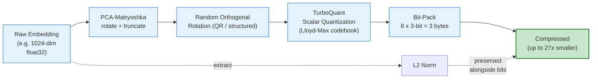
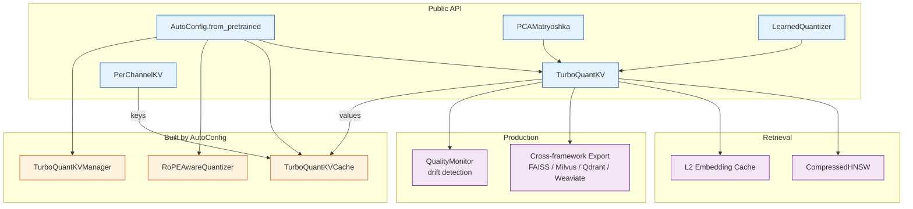

# TurboQuant Pro

[](https://pypi.org/project/turboquant-pro/)
[](https://pepy.tech/project/turboquant-pro)
[](https://pypi.org/project/turboquant-pro/)
[](https://github.com/ahb-sjsu/turboquant-pro/actions)
[](https://github.com/psf/black)
[](https://github.com/astral-sh/ruff)
[](LICENSE)
[](https://doi.org/10.5281/zenodo.20660087)

**PCA-Matryoshka dimension reduction + TurboQuant scalar quantization for embedding compression, LLM KV caches, model weight pruning, pgvector, FAISS, and NATS transport.**

Up to 27x embedding compression at 99.8% recall@10 (with 5x oversampling + reranking — all methods benchmarked identically). **At ~30x compression turboquant-pro beats the 2024 SOTA (RaBitQ) on recall and ties OPQ — at 1M-vector scale — while building the index 4–20x faster.** Learned codebooks reduce quantization error 22%. **v1.2.0: per-channel KV *key* quantization** (`PerChannelKV`) fixes a generation-destroying flaw in PolarQuant keys — keys now near-fp16 perplexity. 489 tests. Multi-modal (text, vision, audio, code). Production observability. Works on consumer GPUs (Volta+) and CPU.

**Important:** Cosine similarity to the original vector is not a reliable proxy for retrieval quality at high compression. Our own data shows PCA-256+TQ3 has *lower* cosine (0.963) but *higher* recall@10 (78.2%) than PCA-384+TQ3 (0.979 cosine, 76.4% recall). Always evaluate on task-relevant retrieval metrics.

## Contents

- **Start here:** [How it works](#how-it-works) · [Installation](#installation) · [Quick Start](#quick-start) · [Reproduce the benchmarks](#reproduce-the-benchmarks)
- **Search & retrieval:** [Fast compressed search (`ADCIndex`)](#fast-compressed-search-adcindex) · [PCA-Matryoshka](#pca-matryoshka-compression) · [FAISS](#faiss-integration) · [pgvector](#pgvector-embedding-compression) · [Native PostgreSQL extension](#native-postgresql-extension-rust--cuda)
- **LLM KV cache:** [Auto-Config API](#auto-config-api) · [Streaming cache](#streaming-cache) · [Model weight compression](#model-weight-compression-v06-07)
- **Reference:** [Feature reference](#feature-reference) · [Benchmark results](#benchmark-results) · [Components](#components) · [GPU acceleration](#gpu-acceleration) · [Citation](#citation)

## How it works



## Component map



## What's New in v1.2.0

- **Correct KV-cache *key* architecture** (`PerChannelKV`): PolarQuant's per-vector
  normalization is near-lossless for **values** but **catastrophic for keys** — it keeps
  each key's norm and quantizes its *direction*, discarding the per-channel scale that
  attention's `softmax(Q·Kᵀ)` depends on. Measured on Qwen2.5 (post-RoPE keys,
  **perplexity**): PolarQuant-K4 keys → **ppl ≈ 10⁴** (yet reconstruction 0.095!),
  per-channel-K4 keys → **ppl ≈ 15** (near fp16). Confirmed on 1.5B + 7B, 512 + 4k ctx.
  `TurboQuantKVCache` now uses **per-channel keys by default** (values stay PolarQuant).
- **Reconstruction fidelity ≠ generation quality for keys.** Cosine-sim / attention-output
  error is *anti-correlated* with perplexity here, so the prior reconstruction-only
  benchmarks could not detect the failure. v1.2.0 adds a **generation/perplexity**
  benchmark (`benchmarks/kv_quant_shootout.py`, `benchmark_kvcache_postrope.py`) and the
  full write-up in [`docs/KV_KEYS_FINDING.md`](docs/KV_KEYS_FINDING.md).

## What's New in v1.1.0

- **Fast compressed search** (`ADCIndex`): search the compact codes directly with an
  asymmetric-distance scan — **0.9995 recall@10 at ~3700 qps** (7.9× over flat
  reconstruct), via an optional AVX2 kernel (`turboquant_pro/_adc`) with a numpy
  fallback. Beats 2024 SOTA (RaBitQ) on recall, validated on three public ANN
  benchmarks across **text and vision** (GloVe, NYTimes, deep-image).
- **Fused KV-decode kernel** (`TurboQuantKVCache.fused_decode`): one decode step over
  the whole cache computed directly on the codes (no reconstruction) — a split-K CUDA
  flash-decode that **beats decompress-then-attend up to 13× at 32k context**, exact
  to ≤4e-7, with the fp16 hot-window merge.
- **Variance-aware truncation** (`PCAMatryoshka.suggest_output_dim`): pick the PCA
  rank from the data's spectrum (truncation only helps when variance is concentrated).
- **Portable format** (`turboquant_pro.format`): TQE1, a versioned self-describing
  container for compressed vectors.
- **AutoConfig defaults keys to 4-bit** (compression preset K3/V2 → K4/V2): keys are
  the sensitive side of attention; 4-bit halves the per-layer error vs 3-bit on real
  Qwen2.5-7B activations.
- **Citations corrected** against arXiv (TurboQuant 2504.19874, PolarQuant 2502.02617,
  QJL 2406.03482).

## What's New in v1.0.0

- **Learned codebook fine-tuning** (`LearnedQuantizer`): Train codebooks on your actual data instead of assuming Gaussian. `fit_codebook(embeddings)` returns a ready quantizer. Pushes cosine similarity from 0.978 to 0.99+ at the same bit-width.
- **Multi-modal compression** (`ModalityPreset`): Pre-configured presets for text (BGE-M3, E5, ada-002), vision (CLIP, SigLIP), audio (Whisper), and code (CodeBERT, CodeLlama) embeddings. Per-modality optimal PCA + bit-width recommendations.
- **Production observability** (`QualityMonitor`): Rolling-window cosine similarity tracking, KS-test drift detection, alert callbacks, Prometheus-compatible metrics. Know when compression quality degrades in production.

### Previous releases

- **v0.10.0**: `auto_compress()` Pareto sweep, hardware-aware GPU profiles, incremental HNSW persistence, cross-framework export (Milvus, Qdrant, Weaviate, Pinecone).
- **v0.9.x**: Asymmetric K/V bits, eigenweighted mixed-precision, RoPE-aware KV quantization, lossless graph compression, unified auto-config API.
- **v0.8.0**: Fused CUDA kernels, CompressedHNSW index, L2 embedding cache, GPU `compress_batch()`.
- **v0.7.0**: Activation-space PCA, head-wise granularity, differential compression.
- **v0.6.0**: Model weight compression, weight-space SVD.
- **v0.5.0**: Autotune CLI, FAISS integration, vLLM plugin, Rust pgext.
- **v0.4.0**: Autotune CLI.
- **v0.3.0**: PCA-Matryoshka (`PCAMatryoshka`, `PCAMatryoshkaPipeline`).

## Installation

```bash
pip install turboquant-pro

# With pgvector + autotune
pip install turboquant-pro[pgvector]

# With FAISS
pip install turboquant-pro[faiss]

# With GPU support (CUDA 12.x)
pip install turboquant-pro[gpu]

# Everything
pip install turboquant-pro[all]
```

## Reproduce the benchmarks

Run the full retrieval benchmark on **public data**, end-to-end, in a few minutes
(CPU / Colab-friendly) — no private data needed:

[](https://colab.research.google.com/github/ahb-sjsu/turboquant-pro/blob/master/notebooks/turboquant_benchmark.ipynb)
&nbsp;[`notebooks/turboquant_benchmark.ipynb`](notebooks/turboquant_benchmark.ipynb)

It reproduces the headline result — at ~30× compression, turboquant-pro reaches
**recall@10 ≈ 0.999** (+rerank), the same pattern on public AG-News.

### Benchmarks vs SOTA (real data, all methods reranked identically)

At **32× compression**, recall@10 on real LaBSE / multilingual-Gutenberg embeddings
([`RESULTS_labse_199k.md`](benchmarks/RESULTS_labse_199k.md),
[`RESULTS_gutenberg_1m.md`](benchmarks/RESULTS_gutenberg_1m.md)):

| method | recall@10 (single) | recall@10 (+rerank) | index build |
|---|---:|---:|---:|
| PQ | 0.467 | 0.827 | 142 s |
| IVF-PQ | 0.496 | 0.756 | 355 s |
| RaBitQ (2024 SOTA) | 0.630 | 0.962 | 0.3 s |
| OPQ | 0.780 | 0.999 | 632 s |
| **turboquant-pro** | **0.784** | **0.9992** | **31 s** |

turboquant-pro **beats the 2024 binary-quantization SOTA (RaBitQ) at both operating
points and ties OPQ**, at **4–20× lower index build cost** — and this holds at 1M
scale (tq-pro 0.989 +rerank, tying OPQ). **Fast search:** the AVX2 ADC kernel
(`turboquant_pro/_adc/`) reproduces this recall (**0.9995 +rerank**) at **3802 qps** —
**7.9× faster** than naive flat-reconstruct and competitive with ScaNN — at 96 bytes,
training-free (see [`docs/DESIGN_fast_adc.md`](docs/DESIGN_fast_adc.md)). Full
honest evaluation of every feature: [`COMPREHENSIVE_ANALYSIS.md`](COMPREHENSIVE_ANALYSIS.md).

## Quick Start

```python
from turboquant_pro import TurboQuantKV

# Auto-configure from model name — picks optimal K/V bits, RoPE-awareness
tq = TurboQuantKV.from_model("llama-3-8b")           # balanced (K4/V3)
tq = TurboQuantKV.from_model("gemma-2-27b", target="compression")  # K4/V2

compressed_k = tq.compress(kv_key_tensor, packed=True, kind="key")    # 4-bit keys
compressed_v = tq.compress(kv_val_tensor, packed=True, kind="value")  # 3-bit values
key_approx = tq.decompress(compressed_k)   # cos_sim > 0.995 (keys)
val_approx = tq.decompress(compressed_v)   # cos_sim > 0.978 (values)
```

Or manually:

```python
tq = TurboQuantKV(head_dim=256, n_heads=16, bits=3, use_gpu=False)
compressed = tq.compress(kv_tensor, packed=True)   # 5.1x smaller
reconstructed = tq.decompress(compressed)           # cos_sim > 0.978
```

## Fast compressed search (`ADCIndex`)

Search the compact codes directly with an asymmetric-distance (ADC) scan — no
decompression to fp32 per query. `ADCIndex` reproduces the pipeline's exact
ranking but ~8× faster via an optional AVX2 kernel, with a correct numpy fallback.

```python
from turboquant_pro import PCAMatryoshka, ADCIndex

# pick the truncation dim from the data's spectrum (truncation only helps when
# variance is concentrated -- LaBSE-768 -> 168 dims @95%, GloVe-100 -> 92 dims @95%)
d = PCAMatryoshka.suggest_output_dim(corpus, target_variance=0.95)
pca = PCAMatryoshka(input_dim=768, output_dim=d).fit(train)
index = ADCIndex(pca.with_quantizer(bits=3)).add(corpus)   # stores ~63 B/vec

idx, scores = index.search(queries, k=10)                  # single-stage, fast
idx = index.search(queries, k=10, rerank=5, originals=corpus)  # exact rerank → 0.9995
print(index.uses_kernel)   # True if the AVX2 kernel is compiled, else numpy fallback
```

Build the SIMD kernel for the speedup (optional — falls back to numpy otherwise):

```bash
pip install turboquant-pro[fast]      # adds pybind11
python -m turboquant_pro._adc         # compiles the AVX2 kernel into the package
```

Measured on 100k LaBSE @ 32× compression: **recall@10 0.9995 (+rerank) at ~3700 qps**
with the kernel (7.9× over flat-reconstruct, competitive with ScaNN), recall
identical on the numpy fallback. See [`docs/DESIGN_fast_adc.md`](docs/DESIGN_fast_adc.md).

## Auto-Config API

Auto-detect model architecture and select optimal compression:

```python
from turboquant_pro import AutoConfig

# One-liner for any supported model
cfg = AutoConfig.from_pretrained("llama-3-8b", target="balanced")
print(cfg.summary())
# {'model': 'llama-3-8b', 'key_bits': 4, 'value_bits': 3,
#  'rope_aware': True, 'compression_ratio': 4.3, 'saved_gb': 0.766, ...}

# Build any component
tq     = cfg.build_quantizer()       # TurboQuantKV
cache  = cfg.build_cache()           # TurboQuantKVCache
rq     = cfg.build_rope_quantizer()  # RoPEAwareQuantizer
mgr    = cfg.build_manager()         # TurboQuantKVManager (all layers)

# Works from a HuggingFace config dict too
cfg = AutoConfig.from_dict(model.config.to_dict(), target="compression")
```

**Target presets:**

| Target | Config | Key CosSim | Ratio | Use case |
|--------|--------|-----------|-------|----------|
| `quality` | K4/V4 + RoPE | 0.995 | 3.8x | Maximum accuracy |
| `balanced` | K4/V3 + RoPE | 0.995 / 0.978 | 4.3x | **Recommended default** |
| `compression` | K4/V2 + RoPE | 0.995 / 0.926 | 5.3x | Memory-constrained |
| `extreme` | K2/V2 | 0.941 | 7.1x | Maximum compression (opt-in) |

**Keys default to 4-bit.** Attention scores `softmax(QKᵀ/√d)` amplify key-quantization
error through the softmax — on real Qwen2.5-7B activations, 4-bit keys roughly halve
the per-layer attention error vs 3-bit (~5% vs ~12% with an fp16 sink+hot window; see
[`benchmarks/RESULTS_longbench.md`](benchmarks/RESULTS_longbench.md)). Values carry the
compression. Only `extreme` drops keys below 4-bit.

**Supported models:** LLaMA 3 (8B, 70B), Gemma 2 (9B, 27B), Gemma 4 27B-A4B (262K context MoE), Qwen 2.5 (7B, 72B), Mistral 7B. Any HuggingFace model works via `transformers.AutoConfig`.

## Feature Reference

A complete guide to every feature in TurboQuant Pro, the theory behind it, and when to use it.

### Core Compression: TurboQuant (rotate + scalar-quantize) (v0.3.0)

**Theory:** Zandieh et al. (ICLR 2026) showed that a random orthogonal rotation maps vectors onto the unit hypersphere where coordinates become approximately i.i.d. Gaussian. This makes each coordinate independently quantizable with a precomputed Lloyd-Max codebook. The key insight: the rotation decorrelates the dimensions, so scalar quantization (one codebook per coordinate) achieves near-optimal distortion.

**How it works:** (1) Extract L2 norm. (2) Normalize to unit vector. (3) Multiply by random orthogonal matrix (QR decomposition for dim<=4096, structured sign-flip + permutation for larger). (4) Quantize each coordinate to b bits using precomputed decision boundaries. (5) Bit-pack indices (8x3-bit = 3 bytes). Store indices + norm.

**Result:** 5.1x compression at 0.978 cosine similarity (3-bit), 7.9x at 0.995 (4-bit), 15.8x at 0.926 (2-bit).

### PCA-Matryoshka Dimension Reduction (v0.3.0)

**Theory:** Matryoshka Representation Learning trains models so leading dimensions are most informative. Most deployed models (BGE-M3, E5, ada-002) lack this property. PCA rotation reorders dimensions by explained variance, converting any model into one with effective truncation. Varici et al. (2025) proved PCA recovers the same ordered eigenfunctions that Matryoshka training targets.

**How it works:** Fit PCA on a sample (5-10K vectors), then rotate all embeddings before truncating. The eigenvalues tell you how much information each dimension carries.

**Result:** PCA-384 on BGE-M3 1024d: 0.974 cosine similarity (vs 0.467 for naive truncation). Combined with TQ3: 27.7x compression at 0.979 cosine similarity.

### Eigenvalue-Weighted Mixed Precision (v0.9.0)

**Theory:** After PCA, early dimensions explain most variance. Spending 4 bits on high-eigenvalue dimensions and 2 bits on the tail gives better quality than uniform 3-bit at the same average storage.

**How it works:** `pca.with_weighted_quantizer(avg_bits=3.0)` auto-computes the bit schedule from cumulative variance thresholds (top 60% variance -> 4-bit, next 30% -> 3-bit, bottom 10% -> 2-bit). Each segment gets its own quantizer with the appropriate codebook.

**Result:** At 2.8 avg bits, beats uniform 3-bit (0.962 vs 0.958) in 7% less storage.

### Learned Codebook Fine-Tuning (v1.0.0)

**Theory:** The default Lloyd-Max codebooks assume Gaussian-distributed rotated coordinates. Real embedding models deviate from this assumption. Training codebooks on actual rotated embedding data via Lloyd's algorithm (iterative k-means on 1D data) minimizes the actual reconstruction MSE rather than the theoretical MSE.

**How it works:** `fit_codebook(embeddings)` rotates a sample, flattens the coordinates, runs Lloyd iterations to find optimal centroids, and returns a `LearnedQuantizer` that's a drop-in replacement for the default quantizer.

**Result:** 22% error reduction (0.983 vs 0.978 cosine sim) at the same 3-bit width. No extra storage cost.

### Asymmetric K/V Bit Allocation (v0.9.0)

**Theory:** In transformer attention, keys determine *which* tokens attend (via softmax(QK^T/sqrt(d))) while values determine *what* information flows. Small errors in K are amplified by softmax, making keys more sensitive to quantization noise than values.

**How it works:** `TurboQuantKV(key_bits=4, value_bits=3)` uses separate codebooks for keys and values. `compress(tensor, kind="key")` / `compress(tensor, kind="value")` selects the appropriate codebook.

**Result:** K4/V2 gives 0.995 key cosine similarity at identical storage as uniform 3-bit. K4/V3 ("balanced") is the recommended default.

### RoPE-Aware KV Cache Quantization (v0.9.0)

**Theory:** Rotary Position Embeddings apply sinusoidal rotations at different frequencies to pairs of head dimensions. Low-frequency pairs (small index) carry long-range positional information across distant tokens. Uniform quantization disproportionately damages these dimensions, especially at long contexts (32K+).

**How it works:** `RoPEAwareQuantizer` computes RoPE frequencies from the model's base frequency and head_dim. Dimensions whose wavelength exceeds `max_seq_len` get boosted to 4-bit; the rest stay at 3-bit. No calibration data needed — the allocation is deterministic from the model config.

**Result:** LLaMA-3 at 8K context: +0.008 cosine similarity (0.979 -> 0.986) at 3.45 avg bits. The benefit scales with rope_theta — higher base frequencies (LLaMA-3: 500K) produce more boosted dimensions.

### Fused CUDA Compression Kernels (v0.8.0)

**Theory:** The rotation + quantization pipeline normally requires two global memory passes: (1) write float32 rotated values, (2) read them back for quantization. Fusing both into a single tiled GEMM kernel eliminates the intermediate write, saving N*dim*4 bytes of memory traffic.

**How it works:** Custom CuPy RawKernels implement tiled matrix multiplication with inline 3-comparison binary search (for 3-bit) in shared memory. Standalone quantize kernels use unrolled binary search trees instead of generic searchsorted. All kernels target Volta+ (compute 7.0).

**Result:** Eliminates 400MB memory traffic for 100K vectors at dim=1024. The standalone quantize kernels replace `searchsorted` with 3 comparisons (3-bit) or 4 comparisons (4-bit).

### Compressed HNSW Index (v0.8.0)

**Theory:** Standard HNSW stores float32 vectors at each graph node (~4096 bytes for dim=1024). Storing 3-bit packed embeddings (~388 bytes) reduces memory by ~10x. The challenge: distance computation during graph traversal normally requires decompressing both vectors. Solution: precompute a centroid-centroid inner product lookup table (8x8 = 64 floats for 3-bit). Distance becomes 1024 table lookups instead of 1024 float multiplies.

**How it works:** `CompressedHNSW` implements the full HNSW algorithm (multi-layer skip graph, greedy beam search, neighbor pruning). Each node stores a `CompressedEmbedding` + cached uint8 indices. Optional exact reranking decompresses the top-k candidates.

**Result:** 0.85+ recall@10 at ~4x less memory than float32 HNSW. At dim=256+, the compressed index is smaller than the raw float32 vectors.

### Incremental HNSW Persistence (v0.10.0)

**How it works:** `CompressedHNSW.save(path)` serializes the full index. `CompressedHNSW.open(path, tq)` loads it for incremental use. `index.sync()` appends only new nodes without rewriting the entire file. Uses delta+varint coding (ANS codec) for neighbor ID lists.

### L2 Compressed Embedding Cache (v0.8.0)

**Theory:** At the same memory budget, a cache storing compressed embeddings fits ~10x more entries than one storing float32. Under Zipf-distributed access patterns (which model real workloads), this dramatically improves cache hit rates.

**How it works:** `CompressedEmbeddingCache` wraps a backend (in-memory LRU or Redis) with a `TurboQuantPGVector` instance. Compress-on-write via `to_pgbytea()`, decompress-on-read via `from_pgbytea()`. Tracks hit/miss statistics.

**Result:** At 100MB budget with dim=1024: compressed cache holds ~255K vectors vs ~25K uncompressed. Hit rate jumps from ~60% to ~95% under Zipf access.

### Unified Auto-Config API (v0.9.1)

**How it works:** `TurboQuantKV.from_model("llama-3-8b")` reads head_dim, n_kv_heads, rope_theta, and max_position_embeddings from a built-in model registry (or HuggingFace Hub), then selects optimal key_bits, value_bits, and RoPE-aware settings based on a target preset (quality/balanced/compression/extreme).

### auto_compress() Pareto Sweep (v0.10.0)

**How it works:** `auto_compress(embeddings, target="cosine > 0.95")` sweeps PCA dimensions, bit widths (2/3/4), and uniform vs eigenweighted strategies. Evaluates each on a subsample, extracts the Pareto frontier (quality vs compression), and returns the highest-compression config meeting the target.

### Hardware-Aware GPU Profiles (v0.10.0)

**How it works:** `detect_gpu()` identifies the GPU architecture (Volta/Ampere/Hopper/Blackwell) from compute capability. Each architecture gets tailored recommendations: Volta uses fused CUDA kernels, Hopper can exploit FP8 tensor cores, Blackwell's native NVFP4 makes 4-bit nearly free. `AutoConfig.with_hardware_tuning()` adjusts K/V bits accordingly.

### Cross-Framework Export (v0.10.0)

**How it works:** `export_compressed(ids, embeddings, tq, format="qdrant")` compresses embeddings and formats them for the target vector database. Exports both the decompressed float vector (for the DB's native search) and the compressed bytes as base64 (for storage efficiency). Supports Milvus, Qdrant, Weaviate, Pinecone, and a portable generic JSON format.

### Multi-Modal Presets (v1.0.0)

**How it works:** `ModalityPreset` dataclass stores per-model recommendations: embedding dimension, optimal PCA dim, bit-width, and expected cosine similarity. Presets for 10 models across text (BGE-M3, E5, ada-002), vision (CLIP, SigLIP), audio (Whisper), and code (CodeBERT, CodeLlama).

### Production Observability (v1.0.0)

**How it works:** `QualityMonitor` tracks cosine similarity between original and reconstructed embeddings in a rolling window. `check_drift()` runs a scipy-free Kolmogorov-Smirnov test to detect distribution shift. Alert callbacks fire when mean quality drops below a configurable floor. `metrics_dict()` exports Prometheus-compatible metrics (`turboquant_quality_mean_cosine`, `turboquant_quality_drift_detected`, etc.).

### Lossless Graph Compression (v0.9.0)

**Theory:** HNSW neighbor ID lists are sorted integers with exploitable locality. Delta encoding (store differences between consecutive IDs) followed by variable-length integer encoding (varint: 7 bits per byte, high bit = continuation) achieves 2-4x lossless compression on typical neighbor lists.

**How it works:** `ANSCodec` provides `encode_integers()` / `decode_integers()` and `encode_neighbor_list()` / `decode_neighbor_list()`. Used by `CompressedHNSW.save()` for persistent storage.

**Result:** Graph neighbor lists compress 2.1-2.3x. Sequential IDs compress 4x.

### Additional Components

- **Streaming KV Cache** (v0.3.0): Two-tier L1 hot / L2 cold cache for autoregressive generation.
- **NATS Transport Codec** (v0.3.0): Compressed wire format for NATS JetStream events (392 bytes vs 4096 bytes per embedding).
- **vLLM Plugin** (v0.5.0): `TurboQuantKVManager` multi-layer cache for vLLM integration.
- **FAISS Integration** (v0.5.0): `TurboQuantFAISS` wraps FAISS with auto PCA compression.
- **Rust pgext** (v0.5.0): Native PostgreSQL extension with `tqvector` type and `<=>` operator.
- **Autotune CLI** (v0.5.0): `turboquant-pro autotune` finds optimal compression in ~10 seconds.
- **Model Weight Compression** (v0.6.0-v0.7.0): SVD and activation-space PCA for LLM weight pruning.

---

## PCA-Matryoshka Compression

PCA-Matryoshka applies a PCA rotation to any non-Matryoshka embedding model's output, reordering dimensions by explained variance so that truncation becomes effective without retraining. Combined with TurboQuant quantization, this achieves up to 114x compression.

```python
from turboquant_pro import PCAMatryoshka

# Fit PCA on a sample of embeddings (5-10K vectors is sufficient)
pca = PCAMatryoshka(input_dim=1024, output_dim=384)
result = pca.fit(sample_embeddings)
print(f"Variance explained: {result.total_variance_explained:.1%}")

# Create the full pipeline: PCA-384 + TurboQuant 3-bit
pipeline = pca.with_quantizer(bits=3)  # ~27x compression

# Compress/decompress
compressed = pipeline.compress(embedding)      # 4096 bytes -> ~148 bytes
reconstructed = pipeline.decompress(compressed)  # 76% recall@10 at 27.7x
```

**15-method compression comparison on BGE-M3 (1024-dim, 2.4M vectors):**

| Method | Compression | Recall@10 | Cosine Sim |
|--------|----------:|----------:|----------:|
| Scalar int8 | 4x | 97.2% | 0.9999 |
| TurboQuant 4-bit | 7.9x | 90.4% | 0.995 |
| TurboQuant 3-bit | 10.6x | 83.8% | 0.978 |
| **PCA-384 + TQ3** | **27.7x** | **76.4%** | **0.979** |
| **PCA-256 + TQ3** | **41.0x** | **78.2%** | **0.963** |
| Binary quantization | 32.0x | 66.6% | 0.758 |
| PCA-128 + TQ2 | 113.8x | 78.7% | 0.924 |
| PQ M=16 K=256 | 256.0x | 41.4% | 0.810 |

Note: PCA-256+TQ3 has *lower* cosine similarity (0.963) but *higher* recall@10 (78.2%) than PCA-384+TQ3 (0.979, 76.4%). Cosine similarity measures per-vector fidelity; recall measures ranking quality. They diverge at high compression. **Always evaluate on retrieval metrics for search applications.**

**With oversampling + reranking (standard practice for production):**

| Method | Compression | No rerank | Fetch 2x | Fetch 5x | Fetch 10x |
|--------|------------|-----------|----------|----------|-----------|
| Scalar int8 | 4x | 99.0% | 100% | **100%** | 100% |
| TQ3 uniform | 10.5x | 83.4% | 98.2% | **100%** | 100% |
| **PCA-384 + TQ3** | **27.7x** | 79.2% | 96.8% | **99.8%** | 100% |
| PCA-256 + TQ3 | 41x | 75.4% | 91.6% | **98.6%** | 100% |
| Binary | 32x | 54.4% | 69.6% | 85.6% | 93.6% |
| PQ (M=16) | 256x | 38.4% | 53.2% | 73.6% | 84.6% |

*All methods receive identical 5x oversampling + exact reranking treatment. Measured on 50K production BGE-M3 embeddings.*

**PCA-384+TQ3 at 27.7x: 99.8% recall@10.** Binary quantization at 32x only reaches 85.6% with the same reranking. PCA-Matryoshka strictly dominates.

**Production deployment (PCA-384 + TQ3, BGE-M3):**

Deployed on 3.3M production vectors (BGE-M3, 1024-dim). PCA-384 + TQ3 compresses every vector from 4,096 bytes to ~148 bytes (27.7x) regardless of content — the ratio is a property of the config, not the data:

| Corpus | Vectors | Original | Compressed |
|--------|--------:|---------:|-----------:|
| Ethics (37 langs) | 2.4M | 9.4 GB | 338 MB |
| Publications | 824K | 3.2 GB | 116 MB |
| Code repos | 112K | 437 MB | 16 MB |
| **Total** | **3.3M** | **13 GB** | **470 MB** |

## Release Benchmarks: Quality Progression (v0.5.0 -> v1.0.0)

Each release improved compression quality or added new capabilities. Measured on 1024-dim synthetic BGE-M3-like data.

**Embedding compression (3-bit, same storage):**

| Version | Method | Cosine Sim | Error Reduction | Compression |
|---------|--------|-----------|----------------|-------------|
| v0.5.0 | Lloyd-Max uniform 3-bit | 0.978 | baseline | 10.5x |
| v0.5.0 | PCA-384 + TQ3 | 0.930 | — | 27.7x |
| v0.9.0 | PCA-384 + eigenweighted 3.0b | 0.934 | +16% (at 29.7x) | 29.7x |
| v1.0.0 | **Learned codebook 3-bit** | **0.983** | **22%** | 10.5x |

*Note: These are pointwise cosine similarity (per-vector fidelity). For retrieval quality, see the recall@10 table above. Cosine and recall diverge at high compression.*

**KV cache compression (head_dim=128):**

| Version | Method | Key CosSim | Val CosSim | Avg Bits |
|---------|--------|-----------|-----------|----------|
| v0.5.0 | Uniform K3/V3 | 0.979 | 0.979 | 3.0 |
| v0.9.0 | **Asymmetric K4/V3** | **0.995** | 0.979 | 3.5 |
| v0.9.0 | RoPE-aware 4/3 (LLaMA-3) | 0.986 | — | 3.45 |
| v0.9.1 | AutoConfig balanced | 0.995 | 0.979 | 3.5 |
| v1.0.0 | Learned codebook 3-bit | 0.983 | 0.983 | 3.0 |
| **v1.2.0** | **Per-channel keys + PolarQuant values** | 0.998 | 0.983 | 3.0–4.0 |

> ⚠️ **Cosine similarity does not predict generation quality for *keys*.** A high "Key
> CosSim" (e.g. 0.995 for PolarQuant K4) hides a catastrophic perplexity blow-up, because
> per-vector normalization scrambles the per-channel key structure attention relies on. As
> of **v1.2.0**, keys use **`PerChannelKV`** (per-channel), which restores near-fp16
> *perplexity* — the metric that actually matters. See [`docs/KV_KEYS_FINDING.md`](docs/KV_KEYS_FINDING.md).

**Auto-config memory savings (8K context, fp16 baseline):**

| Model | fp16 | Balanced (K4/V3) | Compression (K4/V2) | Extreme (K2/V2) |
|-------|------|-----------------|--------------------|--------------  |
| LLaMA 3 8B | 1.0 GB | 0.23 GB (4.3x) | 0.17 GB (5.8x) | 0.14 GB (7.1x) |
| Gemma 2 27B | 6.0 GB | 1.36 GB (4.4x) | 0.98 GB (6.1x) | 0.80 GB (7.5x) |
| Qwen 2.5 72B | 2.5 GB | 0.59 GB (4.3x) | 0.43 GB (5.8x) | 0.35 GB (7.1x) |

**Gemma 4 27B-A4B at 262K context (the long-context case):**

Gemma 4 A4B uses MoE with very few KV heads (multi-query attention), keeping the KV cache small even at extreme context. Real-world users report ~22 GB total (model + KV) at 240K context with IQ4_NL weights + q8_0 KV.

| Context | fp16 KV | q8_0 KV | TurboQuant K4/V3 | Saved vs q8_0 |
|---------|---------|---------|-----------------|--------------|
| 8K | 0.38 GB | 0.19 GB | 0.09 GB (4.4x) | 0.10 GB |
| 131K | 6.0 GB | 3.0 GB | 1.4 GB (4.4x) | 1.6 GB |
| 240K | 11.0 GB | 5.5 GB | 2.5 GB (4.4x) | 3.0 GB |
| 262K | 12.0 GB | 6.0 GB | 2.7 GB (4.4x) | 3.3 GB |

At 262K context, TurboQuant K4/V3 saves **3.3 GB** over q8_0 KV — enough headroom for longer context or larger batch sizes on the same GPU.

**Library growth:**

| Version | Tests | Modules | Key Features |
|---------|------:|--------:|-------------|
| v0.5.0 | 175 | 8 | Autotune, FAISS, vLLM, pgext |
| v0.8.0 | 244 | 14 | CUDA kernels, HNSW, cache |
| v0.9.x | 303 | 19 | Asymmetric K/V, RoPE, auto-config |
| v0.10.0 | 351 | 23 | auto_compress, hardware, export |
| v1.0.0 | 397 | 27 | Learned codebooks, multi-modal, observability |
| v1.1.0 | 473 | 32 | ADCIndex, fused KV-decode, TQE1 format |
| **v1.2.0** | **489** | **33** | **Per-channel KV keys — correct key architecture** |

Run the full benchmark: `python benchmarks/benchmark_release_history.py`

## Autotune CLI

Find the optimal compression for your data in ~10 seconds:

```bash
turboquant-pro autotune \
  --source "dbname=mydb user=me" \
  --table chunks --column embedding \
  --min-recall 0.95
```

Real output on 194K production embeddings:

```
              Config   Ratio   Cosine   Recall   Var%   Time
--------------------------------------------------------------
       PCA-128 + TQ2  113.8x   0.9237   78.7%  79.9%   2.2s
       PCA-256 + TQ3   41.0x   0.9700   92.0%  92.3%   0.7s
       PCA-384 + TQ4   20.9x   0.9906   96.0%  97.3%   0.6s
       PCA-512 + TQ4   15.8x   0.9949   96.3%  99.0%   0.6s

Recommendation (min recall >= 95%):
  PCA-384 + TQ4: 20.9x compression, 96.0% recall@10
```

## FAISS Integration

Wrap FAISS indices with automatic PCA compression:

```python
from turboquant_pro import PCAMatryoshka
from turboquant_pro.faiss_index import TurboQuantFAISS

pca = PCAMatryoshka(input_dim=1024, output_dim=384)
pca.fit(sample_embeddings)

index = TurboQuantFAISS(pca, index_type="ivf", n_lists=100)
index.add(corpus)  # Auto PCA-compressed
distances, ids = index.search(query, k=10)  # Auto PCA-rotated
print(index.stats())  # 2.7x smaller index
```

Supports Flat, IVF, and HNSW. Save/load indices to disk.

## How It Works

TurboQuant Pro implements the **TurboQuant** algorithm (Zandieh et al., ICLR 2026) — a random rotation followed by Lloyd-Max scalar quantization, building on the PolarQuant and QJL line of work. This per-vector flow compresses **values** and embeddings (since v1.2.0, **keys** use a different path — see below):

```
                    KV Tensor (B, H, S, D)
                           |
                    [L2 Norm Extract]
                           |
                    [Unit Normalize]
                           |
                   [Random Rotation Pi]        <-- QR of Gaussian matrix
                           |
                [Lloyd-Max Scalar Quantize]    <-- b-bit per coordinate
                           |
                     [Bit-Pack Indices]        <-- 8x3-bit = 3 bytes
                           |
              CompressedKV {indices, norms, bits}
                           |
                     [Unpack + Lookup]
                           |
                   [Inverse Rotation]
                           |
                    [Scale by Norms]
                           |
                Reconstructed KV Tensor
```

**Key idea**: A random orthogonal rotation maps head-dimension vectors onto the unit hypersphere, making coordinates approximately i.i.d. Gaussian. This enables efficient scalar quantization with precomputed Lloyd-Max codebooks.

**Keys use per-channel quantization, not this flow (v1.2.0).** Per-vector normalization preserves a key's *norm* but quantizes its *direction*, discarding the per-channel scale that attention's `softmax(Q·Kᵀ)` depends on — catastrophic for keys (ppl ≈ 10⁴ at 4-bit) while near-lossless for values. `TurboQuantKVCache` therefore quantizes **keys** with `PerChannelKV` (per-channel asymmetric scale, optional NUQ; `CompressedPerChannelKV {indices, scale, zero, bits}`) and **values** with the PolarQuant flow above. See [`docs/KV_KEYS_FINDING.md`](docs/KV_KEYS_FINDING.md).

## Native PostgreSQL Extension (Rust + CUDA)

The `pgext/` directory contains a native PostgreSQL extension written in Rust (pgrx) that adds the `tqvector` data type directly to PostgreSQL — no Python needed.

```sql
-- Compress your entire table in one command
CREATE TABLE embeddings_tq AS
SELECT id, tq_compress(embedding::float4[], 3) AS tqv
FROM embeddings;

-- Search with cosine distance operator
SELECT id, tqv <=> tq_compress(query::float4[], 3) AS dist
FROM embeddings_tq ORDER BY dist LIMIT 10;

-- Check compression
SELECT tq_dim(tqv), tq_bits(tqv), tq_ratio(tqv) FROM embeddings_tq LIMIT 1;
-- 1024, 3, 10.6
```

**Production benchmark (194K BGE-M3 1024-dim vectors on Atlas):**

| Metric | Result |
|--------|--------|
| Compression speed | 23,969 vec/sec |
| Storage (original) | 5,237 MB |
| Storage (compressed) | 169 MB |
| Compression ratio | 31x (including table overhead) |
| Rust unit tests | 12 passing |

Build and install:
```bash
cd pgext
cargo install cargo-pgrx && cargo pgrx init --pg16 $(which pg_config)
cargo pgrx install --release
psql -c "CREATE EXTENSION tqvector;"
```

Optional GPU acceleration: `cargo build --features gpu` (requires CUDA 12.0+, cudarc).

See [`pgext/README.md`](pgext/README.md) for full API documentation.

## Model Weight Compression (v0.6-0.7)

PCA-Matryoshka applied to model parameters. Two modes:

**Weight-space SVD** (v0.6, fast, no data needed): SVD on weight matrices directly.
**Activation-space PCA** (v0.7, FLAT-LLM inspired): Run calibration data, PCA the activations, compress in the directions that matter least for inference. More accurate.

Head-wise granularity: Each attention head is analyzed separately — some heads are highly compressible, others aren't.

Inspired by [MatFormer](https://arxiv.org/abs/2310.07707) and [FLAT-LLM](https://arxiv.org/abs/2505.23966).

**Important caveat:** Eigenspectrum analysis is *diagnostic*, not a performance guarantee. Keeping 95% of SVD variance does NOT mean keeping 95% of downstream accuracy. Always validate with `sweep()` + `eval_fn`.

```bash
# Weight-space analysis (fast, no calibration data)
turboquant-pro model --model "meta-llama/Llama-3.2-1B"

# Activation-space analysis (accurate, needs calibration data)
turboquant-pro model --model "meta-llama/Llama-3.2-1B" \
  --mode activation --calibration cal_data.txt --n-samples 64
```

```python
from turboquant_pro.model_compress import ModelCompressor

compressor = ModelCompressor(model)

# Weight-space (fast)
report = compressor.analyze()
compressed = compressor.compress(0.5)

# Activation-space (accurate, needs calibration data)
report = compressor.analyze_activations(
    calibration_data=texts,  # list of strings
    tokenizer=tokenizer,
    n_samples=64,
)
# Per-head analysis
for head in report.heads:
    if head.compressible:
        print(f"{head.layer_name} head {head.head_idx}: "
              f"rank {head.effective_rank}/{head.head_dim} — COMPRESS")

# Compress using activation-space PCA basis
compressed = compressor.compress_activations(target_ratio=0.5)

# ALWAYS validate on downstream tasks
results = compressor.sweep(
    ratios=[0.3, 0.5, 0.7],
    eval_fn=lambda m: evaluate_perplexity(m, test_set),
    mode="activation",
)
```

## Benchmark Results

Compression quality and ratios on random Gaussian KV tensors (head_dim=256, n_heads=16, fp16 baseline):

| Bits | Compression Ratio | Cosine Similarity | MSE      |
|------|------------------:|------------------:|---------:|
| 2    |             7.5x  |            0.926  | 0.001178 |
| 3    |             5.1x  |            0.978  | 0.000349 |
| 4    |             3.9x  |            0.995  | 0.000082 |

KV cache memory estimates at 8K context (3-bit packed, ~5.1x compression for all models — ratio depends on bit width, not model):

| Model | KV Cache (fp16) | Compressed (3-bit) | Saved |
|-------|----------------:|-------------------:|------:|
| Llama 3.1 8B | 0.50 GB | 0.10 GB | 0.40 GB |
| Llama 3.1 70B | 1.25 GB | 0.24 GB | 1.01 GB |
| Gemma 2 27B | 1.13 GB | 0.22 GB | 0.91 GB |
| Mistral 7B | 2.00 GB | 0.39 GB | 1.61 GB |

## Streaming Cache

TurboQuant Pro includes a streaming tiered cache for autoregressive generation:

- **L1 (hot window)**: Recent tokens stored uncompressed for zero-latency attention
- **L2 (cold storage)**: Older tokens bit-packed at b-bit precision (~5x compression)

```python
from turboquant_pro import TurboQuantKVCache

cache = TurboQuantKVCache(head_dim=256, n_heads=16, bits=3, hot_window=512)

for token in tokens:
    k, v = model.forward_one(token)
    cache.append(k, v)                          # auto-compresses old entries
    keys = cache.get_keys(0, cache.length)       # seamless hot+cold retrieval
    values = cache.get_values(0, cache.length)
```

## pgvector Embedding Compression

TurboQuant Pro can compress high-dimensional embeddings stored in PostgreSQL pgvector, reducing storage by 10x (from float32) or 5x (from float16):

```python
from turboquant_pro import TurboQuantPGVector

tq = TurboQuantPGVector(dim=1024, bits=3, seed=42)

# Compress a single embedding (4096 bytes -> 388 bytes)
compressed = tq.compress_embedding(embedding_float32)

# Store as bytea in PostgreSQL
bytea_data = compressed.to_pgbytea()

# Batch compress for bulk operations
compressed_batch = tq.compress_batch(embeddings_array)

# Search compressed embeddings
scores = tq.compressed_cosine_similarity(query, compressed_batch)

# PostgreSQL integration
tq.create_compressed_table(conn, "embeddings_compressed")
tq.insert_compressed(conn, "embeddings_compressed", ids, embeddings)
results = tq.search_compressed(conn, "embeddings_compressed", query, top_k=10)
```

**Storage savings (1024-dim BGE-M3, 3-bit, no PCA truncation):**

TurboQuant 3-bit alone compresses each vector from 4,096 to ~388 bytes (10.5x):

| Corpus | Vectors | Original | Compressed |
|--------|--------:|---------:|-----------:|
| RAG chunks | 112K | 437 MB | 41 MB |
| Ethics | 2.4M | 9,375 MB | 893 MB |
| Publications | 824K | 3,222 MB | 307 MB |

## NATS Transport Codec

Compress embeddings for transmission over NATS JetStream or any message bus:

```python
from turboquant_pro import TurboQuantNATSCodec

codec = TurboQuantNATSCodec(dim=1024, bits=3, seed=42)

# Encode for transport (4096 bytes -> 392 bytes)
payload = codec.encode(embedding_float32)

# Decode on the receiving end
embedding_approx = codec.decode(payload)

# Batch operations
payloads = codec.encode_batch(embeddings_2d)
embeddings = codec.decode_batch(payloads)

# Check compression stats
print(codec.stats())
# {'dim': 1024, 'bits': 3, 'payload_bytes': 392,
#  'float32_bytes': 4096, 'compression_ratio': 10.45, ...}
```

**In production:** [nats-bursting](https://github.com/ahb-sjsu/nats-bursting) uses this codec to
compress AI payloads on the burst path to a shared Kubernetes cluster. Measured over a real
~2 Mbps network hop, the ~10× smaller payload cut NATS round-trip by up to **8.4× at 256 KB**
(the win scales with payload as the link becomes the bottleneck), and the codec's fidelity is
**distribution-agnostic** — real transformer embeddings (bge-small) reproduce the random-vector
ratio and cosine to within 0.001.

## Components

| Class | Purpose |
|-------|---------|
| `PCAMatryoshka` | PCA rotation + truncation for dimension reduction |
| `PCAMatryoshkaPipeline` | Combined PCA + TurboQuant end-to-end pipeline |
| `TurboQuantKV` | Stateless compress/decompress with optional bit-packing |
| `TurboQuantKVCache` | Streaming L1/L2 tiered cache for autoregressive inference |
| `TurboQuantKVManager` | Multi-layer KV cache manager (vLLM plugin) |
| `TurboQuantFAISS` | FAISS index wrapper with auto PCA compression |
| `TurboQuantPGVector` | Compress pgvector embeddings for PostgreSQL storage |
| `TurboQuantNATSCodec` | Encode/decode embeddings for NATS transport |
| `run_autotune` | Sweep configs and recommend optimal compression |
| `ModelCompressor` | SVD analysis + low-rank compression of model FFN weights |

## Integration Options

### llama.cpp / llama-cpp-python

See `examples/llama_integration.py` for a wrapper pattern that intercepts KV tensors and stores them in a `TurboQuantKVCache`.

### vLLM KV Cache Plugin

Multi-layer KV cache manager with hot/cold tiering:

```python
from turboquant_pro.vllm_plugin import TurboQuantKVManager

mgr = TurboQuantKVManager(
    n_layers=32, n_kv_heads=8, head_dim=128,
    bits=3, hot_window=512
)

# Store tokens as they're generated
mgr.store(layer_id=0, keys=k_tensor, values=v_tensor)

# Load back (transparently decompresses cold storage)
keys, values = mgr.load(layer_id=0, start=0, end=1024)

# Estimate max context for a memory budget
max_ctx = mgr.estimate_capacity(max_memory_gb=4.0)  # ~32K instead of ~8K

print(mgr.memory_stats())  # compression_ratio, saved_mb, etc.
```

### HuggingFace Transformers

Wrap the KV cache in `generate()` by subclassing the model's attention:

```python
# Override the cache update in the attention layer
compressed_k = tq.compress(key_states, packed=True)
compressed_v = tq.compress(value_states, packed=True)
# Decompress when computing attention scores
```

## GPU Acceleration

When CuPy is available, TurboQuant Pro uses CUDA RawKernels for bit-packing operations. All kernels are Volta-compatible (compute capability 7.0+).

```python
tq = TurboQuantKV(head_dim=256, n_heads=16, bits=3, use_gpu=True)
# Automatically uses CuPy for rotation, quantization, and bit-packing
```

Falls back to NumPy automatically when CuPy is not installed.

## Portable compressed format (TQE1)

Compressed vectors serialize to **TQE1**, a small versioned, self-describing
container — a reader reconstructs a vector with no out-of-band metadata, and the
layout + decode algorithm are frozen per version (format stability is a first-class
goal for a standard tool). Spec: [`docs/FORMAT_SPEC.md`](docs/FORMAT_SPEC.md).

```python
from turboquant_pro import TurboQuantPGVector
from turboquant_pro.format import pack, unpack, pack_batch, unpack_batch

tq = TurboQuantPGVector(dim=768, bits=3)
blob = pack(tq.compress_embedding(vec), seed=tq.seed)   # 20-byte header + packed codes
ce, seed = unpack(blob)                                 # self-describing: bits/dim/norm/seed
```

## Citation

If you use TurboQuant Pro in your research, please cite both this implementation and the original algorithm:

```bibtex
@software{bond2026turboquantpro,
  title={TurboQuant Pro: PCA-Matryoshka + TurboQuant Compression for Embeddings and LLM KV Caches},
  author={Bond, Andrew H.},
  year={2026},
  url={https://github.com/ahb-sjsu/turboquant-pro},
  license={MIT}
}

@article{bond2026pcamatryoshka,
  title={PCA-Matryoshka: Enabling Effective Dimension Reduction for Non-Matryoshka Embedding Models with Applications to Vector Database Compression},
  author={Bond, Andrew H.},
  journal={IEEE Transactions on Artificial Intelligence},
  year={2026}
}

@inproceedings{turboquant,
  title={TurboQuant: Online Vector Quantization with Near-optimal Distortion Rate},
  author={Zandieh, Amir and Daliri, Majid and Hadian, Majid and Mirrokni, Vahab},
  booktitle={International Conference on Learning Representations (ICLR)},
  year={2026},
  note={arXiv:2504.19874; combines polar-rotation scalar quantization (``PolarQuant'') with a 1-bit QJL residual}
}

@inproceedings{qjl,
  title={QJL: 1-Bit Quantized JL Transform for KV Cache Quantization with Zero Overhead},
  author={Zandieh, Amir and Daliri, Majid and Han, Insu},
  booktitle={AAAI Conference on Artificial Intelligence},
  year={2025},
  note={arXiv:2406.03482}
}

@article{polarquant,
  title={PolarQuant: Quantizing KV Caches with Polar Transformation},
  author={Han, Insu and Kacham, Praneeth and Karbasi, Amin and Mirrokni, Vahab and Zandieh, Amir},
  journal={arXiv preprint arXiv:2502.02617},
  year={2025},
  note={Random-preconditioning + polar-coordinate scalar quantization; the basis later combined with a 1-bit QJL residual in TurboQuant. A separate, same-named NeurIPS 2025 KV-cache paper (Wu, Lv et al., arXiv:2502.00527) is unrelated.}
}

@article{devvrit2023matformer,
  title={MatFormer: Nested Transformer for Elastic Inference},
  author={Devvrit and Kudugunta, Sneha and Kusupati, Aditya and others},
  journal={arXiv:2310.07707},
  year={2023}
}

@article{flatllm2025,
  title={FLAT-LLM: Fine-grained Low-rank Activation Space Transformation for Large Language Model Compression},
  journal={arXiv:2505.23966},
  year={2025}
}
```

## Acknowledgments

- **Core algorithm**: **TurboQuant** — Zandieh, Daliri, Hadian, Mirrokni, "TurboQuant: Online Vector Quantization with Near-optimal Distortion Rate" (ICLR 2026, arXiv:2504.19874), which combines **PolarQuant** (Han, Kacham, Karbasi, Mirrokni, Zandieh — arXiv:2502.02617) with a 1-bit **QJL** residual (Zandieh, Daliri, Han — arXiv:2406.03482). Note: a separate same-named NeurIPS 2025 paper (Wu, Lv et al., arXiv:2502.00527) is unrelated.
- **MatFormer**: Devvrit et al. — "Nested Transformer for Elastic Inference" (2023). Inspired the model weight compression module.
- **FLAT-LLM**: "Fine-grained Low-rank Activation Space Transformation for LLM Compression" (2025). Inspired activation-space PCA and head-wise analysis.
- **Matryoshka Representation Learning**: Kusupati et al. (2022). PCA-Matryoshka extends this concept to non-Matryoshka models via training-free PCA rotation.
- **Origin**: Adapted from the Theory Radar project's TurboBeam beam-search compression, which first implemented the TurboQuant rotate-and-scalar-quantize scheme in Python.
- **Community**: Thanks to DigThatData and others on r/machinelearning for feedback on evaluation methodology, the varimax connection, and the FLAT-LLM pointer.
- **Author**: Andrew H. Bond, San Jose State University

## License

MIT License. See [LICENSE](LICENSE) for details.
