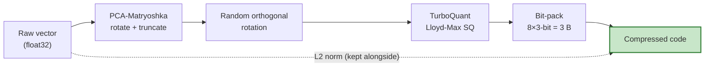

# TurboQuant Pro

[](https://pypi.org/project/turboquant-pro/)
[](https://pepy.tech/project/turboquant-pro)
[](https://pypi.org/project/turboquant-pro/)
[](https://github.com/ahb-sjsu/turboquant-pro/actions)
[](LICENSE)
[](https://doi.org/10.5281/zenodo.20660087)

**Consumer-aware compression for embedding indexes and LLM KV caches.** TurboQuant Pro compresses each vector by the metric its downstream consumer actually uses — retrieval recall for indexes, attention/generation quality for KV caches — **not reconstruction cosine alone**, which is repeatedly shown here to be blind, or even anti-correlated, with quality.

```bash
pip install turboquant-pro
tqp replay embedding_glove_recall --small   # reproduce the headline retrieval claim — CI-gated, runs in seconds
```

- **Embedding retrieval:** on **public data**, preregistered and scored by rule across six arms (GloVe-100, deep-image-96, NYTimes-256, DBpedia ada-002 1M, DBpedia text-embedding-3-large 1M, Wikipedia-1024 10M; RaBitQ in four forms, OPQ and PQ at matched stored bytes), tq-pro **wins at the low-byte end on low-dimensional data, ties RaBitQ and OPQ once the rerank saturates**, and loses only where its own kernel wrapped or at one 132-byte Wikipedia point — [`benchmarks/RESULTS_rabitq_public.md`](benchmarks/RESULTS_rabitq_public.md), ledger status *reproducible*. The private-sample headline — **32× compression at recall@10 ≈ 0.999**, a statistical tie with OPQ and above RaBitQ on a 199k LaBSE sample, **4–20× cheaper to build than OPQ** (RaBitQ itself builds faster) — is a single *reported* run, corroborated at 1M on Gutenberg. The **CI-gated** number is ~9.6× at recall@10 ≈ 0.999 on GloVe-100 (`tqp replay embedding_glove_recall`).
- **KV caches:** architecture-aware **key** quantization avoids a failure that is invisible to reconstruction metrics — PolarQuant keys read 0.995 cosine yet blow perplexity to ≈10⁴; per-channel keys keep it near fp16.
- **At scale & in production:** compressed-domain search, persisted / **larger-than-RAM** sharded + memory-mapped indexes, distribution-free rank **certificates**, one-command **replay**, and drift **monitoring**.

> Every headline number — with its reproduction status, dataset, one-click notebook, and hardware — is a row in **[`CLAIMS.md`](CLAIMS.md)**. The acceptance signal everywhere is rank fidelity / a certificate / the consumer's metric — **never reconstruction cosine.**

The latest **published** pre-release is **2.0.0a3** (scan kernel v3, bit widths that follow the spectrum, residual-coded IVF, the quantization control plane, the public RaBitQ verdicts, the empirical false-clear rate, the reconciled claims ledger, the stratified instruments); 2.0.0a2 brought production semantics for the vLLM KV connector, the Postgres track and the self-metering anatomy instruments. The last stable line is **1.9.x** (larger-than-RAM search + index format v3), and the `tqp` CLI and certification platform shipped in 1.8.0. APIs under `connectors/` may still move before 2.0.0. Full notes: [`CHANGELOG.md`](CHANGELOG.md).

## Installation

```bash
pip install turboquant-pro          # core (numpy only) + the `tqp` CLI
pip install turboquant-pro[torch]   # + operator tracer (`tqp trace`)
pip install turboquant-pro[fast]    # + AVX2 ADC kernel (pybind11)
pip install turboquant-pro[gpu]     # + CuPy CUDA 12.x
pip install turboquant-pro[analysis]  # + readscope + the tqp-readscope bridge
                                    #   (blind read-operator measurement)
pip install turboquant-pro[all]     # everything (pgvector, FAISS, NATS, …)
```

## 30-second embedding compression

The central, best-validated contribution — compress a corpus and search the codes directly:

```python
from turboquant_pro import PCAMatryoshka, ADCIndex

pca = PCAMatryoshka(input_dim=768, output_dim=256)
pca.fit(train_vectors)                                # fits in place; returns a PCAFitResult
pipeline = pca.with_quantizer(bits=3)                 # PCA rotate/truncate + 3-bit TurboQuant
index = ADCIndex(pipeline).add(corpus)                # compressed-domain index (100 B/vec: 256×3 bits + a 4-byte norm)

ids, scores = index.search(queries, k=10)                          # single-pass, fast
ids = index.search(queries, k=10, rerank=5, originals=corpus)   # exact rerank → ~0.9997 (ids only)
```

`PCAMatryoshka.suggest_output_dim(corpus, target_variance=0.95)` picks the truncation dim from the data's spectrum. Two more ways to spend the same bytes:

```python
pipeline = pca.with_spectrum_quantizer(budget_bytes=100)   # widths 1–4 bits per dim, allocated over the PCA spectrum, same 100 B

from turboquant_pro import IVFIndex
ivf = IVFIndex.create(corpus, output_dim=256, bits=3, nlist=1024)   # k-means cells over the same codes, residual-coded
ids, scores = ivf.search(queries, k=10, nprobe=32)                   # scans the probed cells only
```

The spectrum allocation beat uniform widths at four of six byte levels on 1024-d Wikipedia and lost at every level on flat-spectrum GloVe-100 ([`benchmarks/RESULTS_spectrum_bits.md`](benchmarks/RESULTS_spectrum_bits.md), preregistered: S1 MIXED, S2 REFUTED); residual-coded IVF raised single-pass recall@10 over the flat index at the same bytes by 0.02–0.08 on GloVe-100, 0.07–0.19 on deep-image-96 and 0.01–0.02 on NYTimes-256, and by under 0.01 on the 1024- and 1536-d arms, where thousands of centroids shorten a residual little. See the [user guide](docs/guides/user_guide.md).

## Or compress an LLM KV cache

Architecture-aware by quantizer, not just bit-width — per-channel **keys** + PolarQuant **values**:

```python
from turboquant_pro import TurboQuantKVCache

cache = TurboQuantKVCache.robust(head_dim=128, n_heads=32, hot_window=512)  # asym-NF4 keys + 2% outliers, 4-bit K/V
# or auto-configure from a model name:
from turboquant_pro import AutoConfig
cache = AutoConfig.from_pretrained("llama-3-8b", target="balanced").build_cache()   # K4/V3
```

`robust()` is one codebook that stays near-fp16 across every architecture tested (including high-GQA models where symmetric NF4 silently collapses). See the [KV keys finding](docs/KV_KEYS_FINDING.md).

## Choose your workflow

| Goal | Start here |
|---|---|
| Compress a vector index and search it | [User guide](docs/guides/user_guide.md) · [fast ADC design](docs/DESIGN_fast_adc.md) |
| Keep an index larger than RAM (memmap / shards) | [Production lifecycle](docs/guides/production_lifecycle.md) |
| Compress an LLM KV cache correctly | [KV keys finding](docs/KV_KEYS_FINDING.md) · [operator-aware quantization](docs/guides/operator_aware_quantization.md) |
| Compress model weights | [Model-weight guide](docs/guides/model_weight_compression.md) |
| Certify & third-party-verify a deployment | [Certification](docs/guides/certification.md) |
| Reproduce a headline number yourself | [`CLAIMS.md`](CLAIMS.md) · [claim replay](docs/guides/claim_replay.md) |
| Integrate (pgvector, FAISS, NATS, vLLM, …) | [Integrations](docs/integrations.md) |
| Drive it from an agent (LangChain / DSPy / MCP / GPT) | [Agent tools](examples/agentic/) · [`agent_tools`](turboquant_pro/agent_tools.py) |

## Why consumer-aware compression?

One governing principle ties the whole toolkit together:

> **Compress a tensor by the metric its consumer uses. Accept or reject on that metric — recall, perplexity, a rank certificate, an expert-set flip rate — never reconstruction cosine on its own.**

The sharpest illustration is KV-cache **keys**. PolarQuant normalizes each key and quantizes its *direction*, discarding the per-channel scale that `softmax(Q·Kᵀ)` depends on. On Qwen2.5 that reads a reassuring **0.995 key cosine** while perplexity explodes to **≈10⁴**; per-channel key quantization at the same width keeps it near fp16 (≈15). A reconstruction-only benchmark cannot see this. Full write-up: [`docs/KV_KEYS_FINDING.md`](docs/KV_KEYS_FINDING.md).

That boundary is now instrumented, so the principle ships as tooling rather than advice:

- **`rank_certificate`** — turns a measured distortion κ + the corpus's distance-ratio concentration μ̂ into a **distribution-free** rank floor (Kendall τ ≥ 1−2μ̂); a vacuous floor is the per-corpus "exact reranking required" signal. Emit with `tqp certify`, re-check with `tqp verify` (a third party re-hashes the inputs and reproduces the math).
- **`a2_probe`** — selects the quantizer family against the *declared* consumer (cosine / L2 / attention logits) at calibration time; it reproduces the keys catastrophe as a unit test.
- **`operator_trace` / `operator_sensitivity`** — infer each tensor's consumer (softmax score / residual / MoE gate / SSM decay) and apply the discipline that operator needs, validated on real Mixtral, OLMoE, and Mamba models.
- **`read_operators`** — the consumer's read operator `P_C` itself, as a pluggable provider, so the consumer-relative distortion `tr(P_C·Σ_δ)` is a **number you gate on** rather than a principle you appeal to. `identity` (which is reconstruction error, made explicit), `declared`, and `attention_analytic` (a closed form, since a head's read subspace is spanned by its queries) ship in tree; [`tqp-readscope`](plugins/tqp-readscope/) adds blind recovery for consumers with no closed form. Why a registry and not a function: two defensible references for one attention head differ by about **0.3 in overlap**, so a number is not interpretable unless it names the reference it was computed against — `tqp certify --reference PROVIDER` records exactly which one, hashed.
- **`tqp observer learn`** — infer the contract from a request trace instead of asking: consumers weighted by what actually ran, rare readers abstained on rather than dropped, unknown metrics reported rather than mapped, and the sample's size and span recorded so the contract carries the strength of its own evidence. Issue #180.
- **`tqp compose`** — certify the pipeline, not the stage. It refuses a chain whose stages do not actually connect (each stage's certificate records the hashes it was issued over), multiplies the stage distortions, and reports the chain's rank floor and its weakest stage. A composition of trimmed constants is reported as conditional, never as a bound it is not. Issue #182.
- **`tqp capabilities`** — an agent holding a compressed artifact can ask what it may safely do with it, and get three lists back: certified, conditional and not certified, each from the certificates that are actually about that artifact. A contract with no certificate is reported with the command that would create one. Issue #178.
- **`tqp feasibility`** — *should this be compressed at all?* Before any sweep, read a corpus sample through the declared observer and report what it can tell rows apart by, which source dimensions it never reads, how much of what it needs is already missing from this representation (Observation Theory's omission floor, measured), and the fewest bytes that reach a declared distortion. It says INFEASIBLE, ABSTAIN or PASS, and refuses to convert a recall target into a distortion because no distribution-free relation does. Issue #176. Design: [`docs/DESIGN_feasibility.md`](docs/DESIGN_feasibility.md).
- **`observer` contracts** — the observer itself as an artifact (`tqp observer`, a `.tqo` file, profile `tqp-observer/1`): who reads the data, with which registered consumer metrics and weights, under what population, with what floor, budget and fallback, content-addressed by the sha256 of its canonical form. `tqp plan run`, `tqp certify` and `tqp verify` take `--observer` and record or check that hash, so a plan or a certificate always says which observer it was computed for. Issue #173, the first of the Observation Theory family (#183). Design: [`docs/DESIGN_observer_contracts.md`](docs/DESIGN_observer_contracts.md).
- **`read_allocation`** — spends a bit budget *against* that operator by reverse water-filling, which is the same optimization as power allocation across frequency bins with a task's sensitivity in place of a signal's power. `allocation_report` gives the gain over uniform at a fixed budget, and warns when the operator's spectrum is so concentrated that the split rests on one or two directions — which is correct if the operator is, and is also exactly what a sub-dimensionally recovered operator looks like regardless of the consumer. If you are allocating for a long context, allocate against the operator estimated over the whole sequence rather than a calibration prefix — that was better on every cell C-11c measured.

Backed by the companion theory papers: [the-angular-observer](https://github.com/ahb-sjsu/the-angular-observer) (the rank-certificate and (A2) transfer theory) and [geometric-observation](https://github.com/ahb-sjsu/geometric-observation) — the evidence repository home of **Paper III** (Observation Theory: consumer-relative rate–distortion and the omission floor) and **Paper IV** (the consumer-relative flip). TurboQuant Pro is *Paper II* of that series, the compression-as-observation work.

The measurement side ships separately as [**readscope**](https://github.com/ahb-sjsu/readscope) (`pip install readscope`, or `pip install turboquant-pro[analysis]` for the whole stack) — it measures which directions of a vector a computation actually reads, recovering `P_C` from a consumer's outputs alone. Its core is numpy by default and backend-generic by dispatch: hand it CuPy arrays and the linear algebra runs on-GPU with seed-identical probe directions, and the [`tqp-readscope`](plugins/tqp-readscope/) bridge ingests torch tensors zero-copy via DLPack (CPU zero-copy always; CUDA zero-copy into CuPy when present, else exactly one warned host copy). The packages stay deliberately independent — neither imports the other; the bridge is the only code that knows both. readscope's specification is worth reading before trusting a measured operator: recovery against the direction budget is a **cliff at `k = d`**, rank-independent — originally a measured law, since **proved as a theorem** (confined transcripts cannot identify hidden components below full dimension; see readscope's [PRINCIPLES.md](https://github.com/ahb-sjsu/readscope/blob/master/PRINCIPLES.md), P3) — so a sub-dimensional probe returns the dominant direction and little else, and no faster backend moves that cliff, only the FLOPs around it.

### The strategic bet

As models and vector databases scale, the binding constraint shifts from *storing the vector* to *preserving what its consumer reads with it*. Reconstruction fidelity — the objective essentially every quantizer optimizes — is increasingly the wrong one: it can show a reassuring 0.995 cosine while the downstream task collapses. TurboQuant Pro is the production embodiment of the alternative: **measure the consumer's read operator, spend bits against it, and ship a certificate that the ranking survives** — turning a theory program (Paper I's transfer/rank theory, Paper IV's consumer-relative flip) into instruments you run in CI. The bet is that *certified, consumer-aware compression* becomes table stakes as ratios climb and silent quality regressions get more expensive to miss. That is the axis this project competes on — not one more point on the compression-vs-reconstruction curve, but the certificate that the compression preserved the thing that mattered.

## How it works

A per-vector flow — extract L2 norm → unit-normalize → random-orthogonal rotate → Lloyd-Max scalar-quantize → bit-pack — compresses embeddings and KV-cache *values* near-losslessly (the **TurboQuant** algorithm, Zandieh et al., ICLR 2026). KV-cache **keys** take the per-channel path instead (above).


```mermaid
flowchart LR
    A["Raw vector<br/>(float32)"] --> B["PCA-Matryoshka<br/>rotate + truncate"]
    B --> C["Random orthogonal<br/>rotation"]
    C --> D["TurboQuant<br/>Lloyd-Max SQ"]
    D --> E["Bit-pack<br/>8×3-bit = 3 B"]
    E --> F["Compressed code"]
    A -. "L2 norm (kept alongside)" .-> F
    classDef out fill:#c8e6c9,stroke:#2e7d32,stroke-width:2px;
    class F out;
```

**The scan (kernel v3, 2.0.0a3).** `ADCIndex` keeps its codes in the AVX2 kernel's own blocked layout — 32-row blocks, two 4-bit codes per byte — packed once at `add()` and never repacked at search; each `add()` batch is a chunk, and a search is one kernel call over the chunks a query probes with a per-(query, chunk) constant, so an IVF cell is the same object with a centroid. The lookup table is per dimension and dimensions group into weighted segments, so widths that differ across the spectrum scan in one pass. Measured on Atlas (Wikipedia-1024, 1M rows, PCA-512 at 3 bits, 8 threads): 264 B/row from 520, build 28 s from 34, 16.0 ms per query from 18.9, top-10 identical on every query. The 2.0.0a2 kernel wrapped its sums past 257 dimensions; that fix (`3d96506`) is in this release and is why the full-dimension text-embedding-3-large cells of the public comparison lost.

## Benchmark snapshot

Public data, preregistered, scored by rule. Six arms from 96 to 1536 dimensions, up to 10M rows; every method at matched stored bytes, three seeds, identical rerank (5× oversample + exact rerank on the originals). For each arm, the most compressed registered tq-pro configuration that has a matched RaBitQ and OPQ baseline under the preregistration's byte-window rule (highest rerank recall inside 0.80–1.05× the tq-pro bytes), beside those baselines and PQ where its window has one. The verdict is the scorer's paired bootstrap at rr5 (10,000 resamples over the queries). Generated from the scorer's report by `python -m rabitq_public.snapshot`; the full record, every configuration and the 21 cells not run are in [`benchmarks/RESULTS_rabitq_public.md`](benchmarks/RESULTS_rabitq_public.md).

| arm (dim) | method | configuration | B/vec | ratio vs fp32 | recall@10 single | recall@10 +rerank ×5 | build s | verdict vs tq-pro |
|---|---|---|---:|---:|---:|---:|---:|---|
| **GloVe-100** (100-d) | **tq-pro** | `tq-d100-b2` | 29 | 14× | **0.577** | **0.9058** | 3 | |
| | RaBitQ | `rabitqlib_ivf-b1-n4096` | 33.99 | 12× | 0.419 | 0.7298 | 74 | tq-pro wins |
| | OPQ | `opq-m25` | 25 | 16× | 0.518 | 0.8654 | 132 | tq-pro wins |
| | PQ | `pq-m25` | 25 | 16× | 0.518 | 0.8627 | 73 | tq-pro wins |
| **deep-image-96** (96-d) | **tq-pro** | `tq-d96-b2` | 28 | 14× | **0.493** | **0.8634** | 24 | |
| | RaBitQ | `rabitqlib_ivf-b1-n16384` | 32.94 | 12× | 0.472 | 0.8489 | 740 | tq-pro wins |
| | OPQ | `opq-m24` | 24 | 16× | 0.346 | 0.6878 | 90 | tq-pro wins |
| | PQ | `pq-m24` | 24 | 16× | 0.327 | 0.6545 | 37 | tq-pro wins |
| **NYTimes-256** (256-d) | **tq-pro** | `tq-d256-b2` | 68 | 15× | **0.768** | **0.9618** | 3 | |
| | RaBitQ | `rabitq_ivf-b2-n2048` | 84 | 12× | 0.789 | 0.9656 | 26 | tie |
| | OPQ | `opq-m64` | 64 | 16× | 0.764 | 0.9667 | 345 | tie |
| | PQ | `pq-m64` | 64 | 16× | 0.766 | 0.9669 | 178 | tq-pro loses |
| **DBpedia ada-002 (1M)** (1536-d) | **tq-pro** | `tq-d384-b4` | 196 | 31× | **0.830** | **0.9980** | 67 | |
| | RaBitQ | `rabitqlib_ivf-b1-n4096` | 221.36 | 28× | 0.837 | 0.9997 | 218 | tie |
| | OPQ | `opq-m192` | 192 | 32× | 0.809 | 0.9984 | 1611 | tie |
| | PQ | `pq-m192` | 192 | 32× | 0.669 | 0.9680 | 178 | tq-pro wins |
| **DBpedia text-embedding-3-large (1M)** (1536-d) | **tq-pro** | `tq-d384-b4` | 196 | 31× | **0.842** | **0.9990** | 51 | |
| | RaBitQ | `rabitqlib_ivf-b1-n4096` | 221.24 | 28× | 0.855 | 0.9997 | 224 | tie |
| | OPQ | `opq-m192` | 192 | 32× | 0.857 | 0.9999 | 1588 | tie |
| | PQ | `pq-m192` | 192 | 32× | 0.807 | 0.9983 | 178 | tie |
| **Wikipedia-1024 (10M)** (1024-d) | **tq-pro** | `tq-d256-b4` | 132 | 31× | **0.787** | **0.9851** | 340 | |
| | RaBitQ | `rabitqlib_ivf-b1-n16384` | 147.57 | 28× | 0.827 | 0.9975 | 4233 | tq-pro loses |
| | OPQ | `opq-m128` | 128 | 32× | 0.820 | 0.9974 | 1425 | tq-pro loses |
| | PQ | no configuration inside 0.80–1.05 × 132 B | | | | | | |

Read across the dimensions. At 28–29 bytes on the two low-dimensional arms tq-pro wins every pair after rerank, by 0.01 to 0.21. At 196 bytes on both 1536-d corpora (31×) every method is at or near recall 1.0 after rerank and the pairs tie; single-pass, the differences run within 0.03 either way. At 132 bytes on Wikipedia-1024 (31×) tq-pro loses to RaBitQ's 1-bit IVF and to OPQ m=128 by 0.012 after rerank. NYTimes-256 ties RaBitQ and OPQ at 68 bytes and loses to PQ by 0.005. The registered verdicts are *beats RaBitQ* **MIXED** and *ties OPQ* **MIXED**; on the fixed kernel (supplementary `tqfix`) *ties OPQ* reaches HOLDS. Build seconds are wall-clock in the campaign's 4-CPU pods and are not matched across methods; the RaBitQ rows include IVF training at 2,048 to 16,384 centroids.

The earlier private-sample headline, **32× at recall@10 ≈ 0.999** on a 199k LaBSE sample (a statistical tie with OPQ, above RaBitQ, `31 s` build against OPQ's `632 s`), is a single *reported* run in [`benchmarks/RESULTS_labse_199k.md`](benchmarks/RESULTS_labse_199k.md) (ledger row `embedding_labse_32x_headline`) and is corroborated at 1M on Gutenberg; the public table above is the snapshot, and the only CI-gated retrieval number is the GloVe row in [`CLAIMS.md`](CLAIMS.md). **Full tables** — the 15-method BGE-M3 comparison, the rerank frontier, KV-cache generation quality & memory, the RaBitQ estimator-isolated head-to-head — are in [**docs/benchmarks/embeddings.md**](docs/benchmarks/embeddings.md) and [**docs/benchmarks/kv.md**](docs/benchmarks/kv.md).

> **Reading compression ratios.** Ratios vary with source dimension, PCA truncation, code width, retained metadata, and whether exact originals are kept for reranking — so distinguish *compressed payload* vs *all-in index storage* vs *full retrieval-pipeline storage*. The private-sample headline is **32× at recall@10 ≈ 0.999** (status *reported*); the public table above reports each row's own ratio against fp32; other figures in the benchmark docs (e.g. 27.7× single-vector, 114× pipeline-storage) are labeled by their accounting basis and are likewise *reported* rows in [`claims.yaml`](claims.yaml).

## At scale & in production

**Larger-than-RAM search (1.9.0).** `TQEIndex` persists an index and memory-maps it; a block-streamed path keeps peak RAM at `O(n_queries × block)` at any corpus size. `ShardedIndex` splits a corpus into shards that **share one PCA basis** (scores stay comparable) behind a JSON manifest and fans search across them (parallel across cores; `distributed.py` partitions shards across machines). On disk, **index format v3** bit-packs sub-byte codes — a *lossless* re-encoding (rankings bit-identical to v2) at **24.1 B/row** vs 41 B/row in v2 (2M rows / 4-bit / `--no-originals`).

```python
from turboquant_pro import TQEIndex, ShardedIndex

idx = TQEIndex.open("index.tqe", mmap=True)                 # memory-mapped, read/search only
ids, scores = idx.search(queries, k=10, block=100_000)      # bounded-RAM, block-streamed

ShardedIndex.create(corpus, "shards/", shard_size=500_000, bits=3)   # one shared PCA basis
ids, scores = ShardedIndex.open("shards/manifest.json").search(queries, k=10)
```

**The `tqp` CLI** covers the whole lifecycle — `trace → plan → compress → certify → verify → replay → monitor`, plus a persisted-index workflow:

```bash
tqp plan embeddings --embeddings corpus.npy --target "recall@10 >= 0.90"    # recipe on the Pareto frontier
tqp certify --original corpus.npy --reconstructed corpus_q.npy --min-tau 0.8 \
  --task "recall@10 >= 0.995" --environment --html report.html              # rank floor + provenance envelope
tqp verify certificate.json --original corpus.npy --reconstructed corpus_q.npy   # a third party re-checks it
tqp observer init --name retrieval-prod --out prod.tqo && tqp plan run --artifact corpus.npy --observer prod.tqo   # who reads it, as an artifact
tqp index create --embeddings corpus.npy --out shards/ --bits 3 --shard-size 500000
tqp index search shards/manifest.json --queries q.npy --k 10 --mmap --block 100000
tqp query "SELECT id, score FROM 'x.tqe' ORDER BY COSINE(:q) LIMIT 10 WITH (RECALL >= 0.95)" \
  --queries q.npy                                       # declare the target; the planner meets it (1.9.1)
tqp anatomy --npy corpus.npy --k 10                     # hub anatomy: what your hubs ARE (1.9.1)
tqp hubdiff --original corpus.npy --reconstructed corpus_q.npy --min-anti-recall 0.9 \
                                                        # the tail mean recall hides (1.9.1)
tqp anatomy --npy corpus.npy --strata kmeans:8 --save-map map.json   # per-stratum, not pooled (2.0.0a3)
tqp hubdiff --original corpus.npy --reconstructed corpus_q.npy --labels lang.txt \
  --abstain-fails                                       # min-over-strata; ABSTAIN (2.0.0a3)
```

New to hubness and anti-hubs? **[`docs/HUBNESS_PRIMER.md`](docs/HUBNESS_PRIMER.md)**
— the ten-minute primer on why aggregate recall can stay green while your
hardest queries collapse, and how `anatomy`/`hubdiff` catch it. **Trust the
tail, not the mean.**

**Stratified instruments (STRATA Phase 1, 2.0.0a3).** A pooled hubness number can stay
green while one stratum fails, so the gates run **per stratum and report
the minimum**, never the average. Strata come from k-means, a saved area map,
or a label file. Area maps are content-addressed (`tqp-area-map/1`): an
incomplete profile matches nothing, including itself, and a tampered artifact
refuses to load. A stratum with too few rows returns **ABSTAIN** with a
registered cause rather than a pass, and `--abstain-fails` makes that an error
in CI. The relational surface (`attach_strata`) exposes the same results to
DuckDB for querying.

Full command reference: [`docs/CLI.md`](docs/CLI.md). Also here: `QualityMonitor` (cosine + (A2) tangential drift, Prometheus metrics), `behavioral_agreement` (decision-level flip rate + noise floor), hardware-aware profiles (Volta→Blackwell), a portable Triton fused-decode kernel, and cross-framework export (FAISS / Milvus / Qdrant / Weaviate / Pinecone) — see [Integrations](docs/integrations.md).

## Agents & tool use

Autonomous systems can consume the whole pipeline as tools. `turboquant_pro.agent_tools` is a small JSON-in/JSON-out surface with docstrings written for tool-calling models — wrapped for **LangChain**, **DSPy**, an **MCP** server, and custom-GPT **Actions** in [`examples/agentic/`](examples/agentic/).

```python
from turboquant_pro import best_compression_at_recall, certify_ranking

plan = best_compression_at_recall(corpus, k=10, min_recall=0.99)   # "best ratio at 0.99 recall" — accepts on recall, not cosine
cert = certify_ranking(corpus, reconstructed)                      # the distribution-free rank receipt
```

The **goal is a runtime input**: the agent declares the target recall (or the consumer metric, or `k`) *per task*, and the tool accepts and certifies against **that** goal — never reconstruction cosine. That is the project's one rule expressed as an API, and it is *why* cosine can't be the gate: the coordinate worth keeping is the one that carries the currently-declared goal's geometry. Full guide: [`examples/agentic/README.md`](examples/agentic/README.md).

## Feature & stability matrix

The full table is in [`docs/api-stability.md`](docs/api-stability.md) (the source of truth); component reference in [`docs/API.md`](docs/API.md).

| Tier | Components |
|---|---|
| **Stable** | `PCAMatryoshka`, embedding compression pipeline, basic `TurboQuantKV`, TQE1 format |
| **Beta** | `ADCIndex`, `TQEIndex` (memmap + format v3), `ShardedIndex`, `TurboQuantKVCache`, the rank certificate (`tqp certify`/`verify`), the (A2) probe + quality monitor, the `tqp index` lifecycle, the runtime safe-fallback policy, FAISS / pgvector wrappers |
| **Experimental** | `IVFIndex` (residual-coded cells on the v3 scan), `with_spectrum_quantizer` (bit widths allocated over the spectrum), agent tool surface (`agent_tools` + `examples/agentic`), `tqp query` (SQL-ish workload interface), hub anatomy + anti-hub oracle (`tqp anatomy`/`hubdiff`), STRATA stratified instruments (area maps, min-over-strata gates, ABSTAIN, `attach_strata`), **vLLM V1 KV connector** (`turboquant_pro.connectors` — [2.0 roadmap](docs/ROADMAP_2.0.md)), quantizer plugin registry + conformance kit, read-operator provider registry + conformance kit (`read_operators`), CUDA/Triton fused decode, multi-node shard server (`distributed.py`), vLLM manager, model-weight compressor, PostgreSQL extension, NATS transport |

**Scope & honesty:** results are strongest on **text embeddings and LLM workloads**; multimodal APIs/presets exist but are less validated. The RaBitQ comparison is the scoped, preregistered one above (six public arms, verdicts MIXED), not an unscoped "beats"; "robust across every architecture" means every architecture *tested*. A recorded long-generation degradation of asym-NF4 KV quant did **not** survive re-validation (erratum 2026-08-15: measured `nf4a` gap −0.31 vs the recorded 13.7 on gov_report-512, n=40; a larger real collapse, 26.64, exists under *symmetric* NF4 only — see [`benchmarks/kvquant_matrix/REVAL-2026-08-08.md`](benchmarks/kvquant_matrix/REVAL-2026-08-08.md) and the CHANGELOG Errata); readscope's C-11c measured operator drift along the sequence — a key compressed against an early operator is later read by a different one, with a 225%-of-uniform mispricing cost, sixteen head-cells against a paired null — and it has now **been run against the real degradation curve and refuted as its mechanism** (amended C-12, 2026-08-15, on the symmetric-NF4 collapse that does reproduce): teacher forcing removes the consistent growth (sign test p = 0.42) and the error's orientation does no work against a rotated null, so the collapse is autoregressive compounding of a large constant error, not drift. C-11c's drift stands as a measurement; its claim to explain this degradation is dead, recorded in [`calibration/records/c12-longgen-drift-sym.json`](https://github.com/ahb-sjsu/readscope/blob/master/calibration/records/c12-longgen-drift-sym.json). Negative results and caveats are kept first-class in [`docs/claims.md`](docs/claims.md) and the [soundness audit](docs/soundness_audit.md).

> **Not to be confused with** the similarly-named `turboquant` (the HuggingFace KV-cache implementation of the original ICLR TurboQuant algorithm). TurboQuant Pro is a broader, retrieval-first platform that uses that quantizer as **one component**.

## Documentation & reproducibility

- **[Documentation hub](docs/)** — guides, reference, and the 15-minute reviewer path.
- **Agents & MCP:** [`examples/agentic/`](examples/agentic/) — LangChain / DSPy / MCP / custom-GPT wrappers over [`turboquant_pro.agent_tools`](turboquant_pro/agent_tools.py).
- **Artifact hashing (2026-08-16):** every benchmark shard writes a `config.<shard>.json` sidecar whose `artifact_sha256` covers the effective config, the codebook level tables, **and the source of every quantizer function**; the aggregator names what it actually scored and refuses single-arm reporting when hashes disagree. An arm is its tables and its arithmetic, not its label — see the 2026-08-15 erratum for why this exists.
- **Reproduce the claims:** [`CLAIMS.md`](CLAIMS.md) (claim → notebook → hardware → status) · [claim replay guide](docs/guides/claim_replay.md) · [evidence ladder](docs/claims.md).
- **Benchmarks:** [embeddings](docs/benchmarks/embeddings.md) · [KV cache](docs/benchmarks/kv.md) · [release/library growth](docs/RELEASE_HISTORY.md).
- **Formats:** [FORMATS.md](docs/FORMATS.md) (TQE1 / TQIX / certificates at a glance) · [FORMAT_SPEC.md](docs/FORMAT_SPEC.md) · [CERTIFICATE_SPEC.md](docs/CERTIFICATE_SPEC.md).
- **Extending it:** two plugin points, same shape. [`turboquant_pro/plugins.py`](turboquant_pro/plugins.py) registers **quantizers** (what gets certified) — see [`plugins/`](plugins/) for `tqp-bnb`, `tqp-gptq-awq`, `tqp-trtllm`. [`turboquant_pro/read_operators.py`](turboquant_pro/read_operators.py) registers **read operators** (what they are certified against) — see [`plugins/tqp-readscope/`](plugins/tqp-readscope/). Each has its own conformance kit, and in-tree entries register through the same public interface an out-of-tree package uses. Design: [`docs/DESIGN_hardware_and_plugins.md`](docs/DESIGN_hardware_and_plugins.md).
- **Citation:** [`CITATION.cff`](CITATION.cff) (GitHub "Cite this repository") · full BibTeX + acknowledgments in [`docs/CITATION.md`](docs/CITATION.md).
- **Contributing:** start with [`CONTRIBUTING.md`](CONTRIBUTING.md) and the [`good first issue`](https://github.com/ahb-sjsu/turboquant-pro/labels/good%20first%20issue) label. Thanks to our contributors, including [@theshubh007](https://github.com/theshubh007) (L2 distance and the `<->` operator in the PostgreSQL extension, #28) and [@mayuriphad](https://github.com/mayuriphad) (collection-time test guard, #123 / #168). CI runs `ruff check` and `black --check` over `turboquant_pro/`, `tests/`, and `benchmarks/`, and both must pass. Install the hooks so a mismatched local formatter version cannot redden CI: `pip install pre-commit && pre-commit install`. The pinned versions live in [`.pre-commit-config.yaml`](.pre-commit-config.yaml) and must stay equal to the dev extras in `pyproject.toml`.

## License

MIT License. See [LICENSE](LICENSE). Author: **Andrew H. Bond**, San Jose State University.
