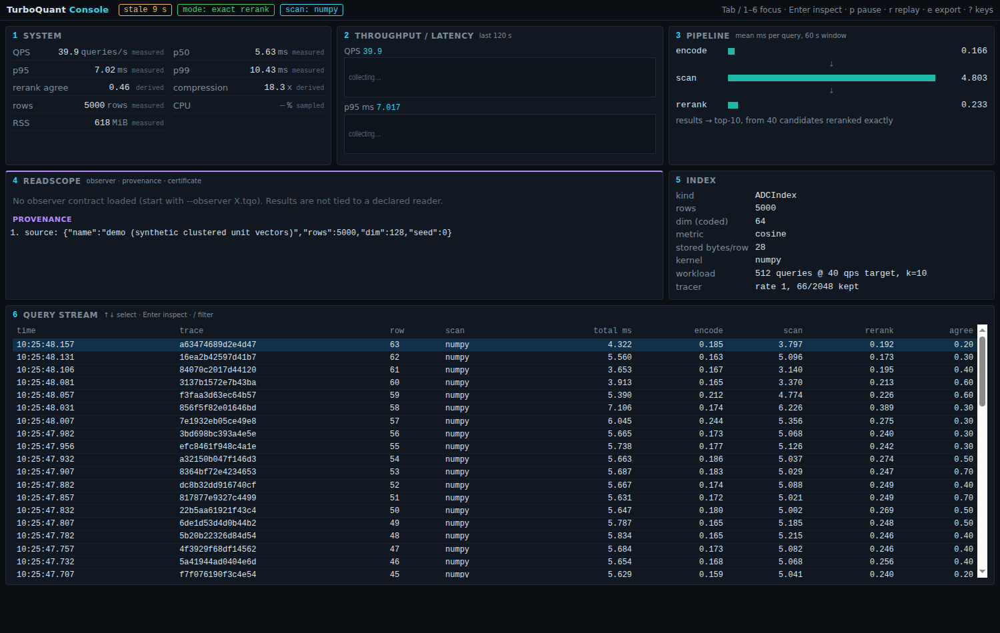

# `tqp` — the turboquant-pro CLI

`tqp` surfaces the library's instruments behind one command. It ships with the
package (console script) and adds no dependencies — the interactive subcommands
are pure stdlib + numpy; `tqp trace` additionally needs `[torch]` + transformers.

> **Status:** Phases 1–4 of [`docs/turboquant_pro_next_level_roadmap.md`](turboquant_pro_next_level_roadmap.md).
> The full pipeline `trace → plan → compress → certify → replay → monitor` is
> live: `version`, `plugin list`/`conformance`, `trace`, `probe`, `plan`,
> `certify`, `verify`, `replay`, `monitor`, `index`, and (1.9.1) `query`,
> `anatomy`, `hubdiff`. No stubs remain.
>
> **Coherence rule.** Every command's acceptance signal is **rank fidelity /
> the (A2) consumer metric / a distribution-free certificate** — never
> reconstruction cosine on its own. Cosine appears only as a *labelled secondary
> diagnostic*, and where it is the base signal (`monitor`) it is guarded by the
> (A2) tangential-fraction / radial-drift statistics, because cosine can read
> ~0.97 while the ranking the consumer actually uses collapses
> ([`docs/KV_KEYS_FINDING.md`](KV_KEYS_FINDING.md)).

## Install

> `tqp` ships in **1.8.0**; the current PyPI release is **1.9.1** — the 1.9 line
> adds larger-than-RAM sharded / memory-mapped search, index format v3, the
> SQL-ish `tqp query`, and the hub-anatomy / anti-hub instruments
> (`tqp anatomy` / `tqp hubdiff`; primer:
> [`HUBNESS_PRIMER.md`](HUBNESS_PRIMER.md)). `pip install turboquant-pro`
> gives you the console script. Add `[torch]` for `tqp trace`.

```bash
pip install turboquant-pro          # gives you `tqp` (1.8.0+)
pip install 'turboquant-pro[torch]' transformers   # additionally enables `tqp trace`
```

## Commands

### `tqp version`
Prints the installed version.

### `tqp plugin list [--target T] [-v]`
Lists registered quantizer plugins (in-tree **and** entry-point plugins), with
tier and targets. `--target` filters (`weight` / `kv_key` / `kv_value` /
`embedding`); `-v` shows descriptions.

```
NAME         TIER    TARGETS
per_channel  beta    kv_key
polar        stable  kv_value
```

### `tqp plugin conformance [names...] [--target T] [--heads H --seq S --dim D | --shape a,b,...]`
Runs the container-contract conformance kit (`run_conformance`) on the given
plugins (default: all registered), reporting `pass` / `skip` / `FAIL` per check.
The default sample is a canonical KV block `(1, H, S, D)` with a per-head DC
offset — matched to the in-tree KV plugins — and the quantizer is built with
`head_dim=D, n_heads=H` to match it. Use `--shape` for non-KV plugins. Exit code
is non-zero if any plugin fails.

```bash
tqp plugin conformance                 # all plugins, default KV block
tqp plugin conformance per_channel     # one plugin
tqp plugin conformance --shape 512,128 # custom sample shape
```

### `tqp trace <hf-model> [--target weight|kv_activation] [--prefer auto|structural|fx] [-v] [--trust-remote-code]`
Traces a Hugging Face model's operator regimes and maps each tensor to its (A2)
quantization discipline. The architecture is built on the **meta device** (real
module structure and names, zero materialized weights), so tracing even a 7B
model costs no download or RAM. Prints regime and discipline-family
distributions; `-v` adds the per-tensor table.

```bash
tqp trace meta-llama/Llama-3.2-1B --target kv_activation
```
```
# meta-llama/Llama-3.2-1B  (target=kv_activation, prefer=auto, fx-traced=..., tensors=...)
regime distribution:
  linear_residual  ...
  softmax_score    ...
(A2) discipline family distribution:
  per_channel      ...
  symmetric        ...
```

### `tqp probe [--npy PATH | --demo {isotropic,dc_offset}] [--consumer cosine|l2|attention_logits] [--bits N] [--queries PATH] [--seed N] [--json]`
The **(A2) consumer-metric probe** (`a2_probe.probe_quotient`): given a sample
batch of the vectors you intend to quantize, it applies the polar (per-vector
norm + direction) and per-channel (affine) family proxies at a matched bit
budget and reports which one preserves the *declared consumer's* ranking
(Spearman agreement of cosine / L2 / attention-logit scores). This is the check
that catches the v1.2.0 KV-keys class at calibration time, where reconstruction
cosine looks fine but attention-logit ranking collapses. Input is a `.npy`
array `(n, d)` (arrays with more axes are flattened to `(-1, d)` — rows are
last-axis vectors, the KV convention). `--demo` substitutes a **labeled
synthetic** batch for a quick look. Exit 0 on success; 2 on a usage/data error.

```bash
tqp probe --npy keys.npy --consumer attention_logits   # attention keys
tqp probe --demo dc_offset --consumer attention_logits --json
```
```
consumer=attention_logits  bits=4
  spearman(polar)        = 0.9911
  spearman(per_channel)  = 0.9924
=> recommend: per_channel
```
It selects a family at calibration time — validate the shipped path end-to-end,
and pair with `tqp monitor` for radial drift in production.

### `tqp monitor --original PATH --reconstructed PATH [--floor F] [--window N] [--tangential-floor T] [--format json|prometheus|text]`
Feeds original/reconstructed `.npy` pairs through
`monitor.QualityMonitor.record_batch` and emits `metrics_dict()` — mean/min/p95
cosine, drift flags, the (A2) tangential fraction — as JSON, Prometheus
text-exposition, or a human table. **Exit code is a gate on `is_healthy`:** 0
when healthy, 1 when not, 2 on a load/shape error. Health requires **both** the
cosine floor (`--floor`) *and* (A2) noncollapse — a self-calibrating guard on
downward tangential drift, plus the optional hard level gate `--tangential-floor`
— so a stream sliding into the norm-dominated regime (where angular quantization
damages ranking while cosine still reads fine) is reported unhealthy, never
healthy-on-cosine-alone.

```bash
tqp monitor --original o.npy --reconstructed r.npy --format prometheus
```
```
# TYPE turboquant_quality_mean_cosine gauge
turboquant_quality_mean_cosine 0.9999
# TYPE turboquant_quality_is_healthy gauge
turboquant_quality_is_healthy 1
```

### `tqp certify --original PATH --reconstructed PATH [--metric cosine|l2] [--anchors N] [--seed N] [--min-tau T] [--task STR] [--task-kind KIND] [--environment] [--limitation STR ...] [--observer CONTRACT] [--validity] [--html FILE] [--out FILE] [--format json|text]`
Emits a **distribution-free rank certificate** (`rank_certificate`) as a
machine-readable `certificate.json`. Given original and reconstructed embedding
`.npy` matrices (same row order), it samples anchor pairs, measures the robust
distortion `kappa` and the corpus concentration `mu_hat`, and reports the
*guaranteed* floors `Kendall tau >= 1 − 2·mu_hat` and `Spearman rho >= 1 − 3·mu_hat`
— with **no distributional assumptions**. The JSON carries provenance (schema +
version, tool version, UTC timestamp, per-input shape/dtype/sha256, params) so a
certificate is reproducible and auditable.

Optional, additive envelope (does not bump `schema_version`; see
[CERTIFICATE_SPEC.md](CERTIFICATE_SPEC.md)): `--task "recall@10 >= 0.995"` declares
the downstream consumer (`--task-kind`, default `retrieval`, records its kind),
`--environment` stamps the run's software/hardware/git state, `--limitation "…"`
(repeatable) records scope caveats, and `--html report.html` writes a readable
human report alongside the JSON.

**Exit code is a gate:** 0 when the certificate certifies a positive floor (or
`tau_floor >= --min-tau` when given), 1 when it is vacuous / below the floor
(the corpus needs exact reranking), 2 on a load/shape error. The JSON is still
written even when the gate fails.

```bash
tqp certify --original emb.npy --reconstructed emb_q.npy --out certificate.json
tqp certify --original emb.npy --reconstructed emb_q.npy --min-tau 0.8   # CI gate
```
```
metric=cosine  anchors=200  pairs=19900
  kappa (robust distortion) = 1.0148
  Kendall  tau  floor       >= 0.8671
  Spearman rho  floor       >= 0.8006
=> certifies Kendall tau >= 0.8671, Spearman rho >= 0.8006 (distribution-free)
```
A vacuous certificate (`tau_floor <= 0`, seen on distance-concentrated corpora)
is itself the signal: single-stage rank fidelity can't be certified, so exact
reranking is mandatory.

### `tqp verify CERTIFICATE.json [--original PATH --reconstructed PATH] [--observer CONTRACT] [--data PATH [--queries PATH]] [--atol A] [--rtol R] [--out FILE] [--format text|json]`
Checks a `certificate.json` **that someone else emitted** — the trust primitive
`certify` was missing. Two layers, and a third: with `--data` (a sample of the
current serving distribution, `--queries` for a retrieval consumer) the
certificate's `validity` section is checked and the report carries
`applicable` beside `verified`: VALID, STALE with a reason (consumer read
geometry changed, data outside calibration coverage, observer contract
changed, certified inputs changed) and an action (REPLAN or RECERTIFY), or
UNCHECKED. A STALE certificate is not false; it is no longer applicable, and
the exit code is 1. Design: [`DESIGN_certificate_expiry.md`](DESIGN_certificate_expiry.md).

- **Schema / self-consistency (always):** the schema and version are recognized,
  the required fields are present, `passed` is a boolean, and the recorded rank
  statistics are inside their valid ranges (`tau_floor`, `spearman_floor` in
  `[-1, 1]`; `kappa >= 0`; `n_pairs` a positive int). Runs offline, no data
  needed — catches a truncated or hand-edited certificate.
- **Independent recompute (when `--original`/`--reconstructed` are given):**
  re-hashes the two `.npy` inputs and compares to the recorded `sha256`, then
  **re-runs the certification with the certificate's own params** (metric,
  anchors, seed) and confirms the recomputed `kappa`/`mu_hat`/`tau_floor`/
  `spearman_floor` match the recorded values within `--atol`/`--rtol`. This is
  the reproduction check: same inputs + same params must reproduce the claim.

**Exit code is a gate:** 0 when verified, 1 when the schema is malformed *or* a
recompute mismatches (bad hash or drifted floor), 2 on a read error. `certify`
writes certificates; `verify` is how a third party trusts one.

```bash
tqp verify certificate.json                                   # schema/self-consistency only
tqp verify certificate.json --original emb.npy --reconstructed emb_q.npy   # full reproduction
```

### `tqp plan embeddings --embeddings PATH [--target STR] [--max-bytes-per-vector N] [--sample N] [--seed N] [--out FILE] [--format json|text]`
Task-aware embedding-compression planner. Runs `auto_compress` to sweep the
PCA/bit/rotation recipe space, then — for the recommended recipe — computes a
**rank-certificate preview** (`certificate_from_embeddings`): the acceptance
signal is the distribution-free Kendall/Spearman floor, *not* reconstruction
cosine (which is reported only as a labelled diagnostic). Emits `plan.json` with
the recommended recipe, the Pareto `alternatives` (each with bytes/vector), the
certificate preview, `risk_flags`, and a `tqp certify` reproduction command.
`--max-bytes-per-vector` constrains the recommendation to a byte budget.

> Scope: `auto_compress` ranks the frontier on the target metric — a **measured
> `recall@k`** when the target is a recall target (the default is
> `recall@10 >= 0.90`), else cosine/ratio for reconstruction-only checks. The
> plan's overall *acceptance* signal is the rank certificate; cosine is only a
> labelled diagnostic. A vacuous preview → exit 1 + "exact reranking required"
> (single-stage rank fidelity can't be certified on this corpus).

```bash
tqp plan embeddings --embeddings emb.npy --target 'recall@10 >= 0.90' --out plan.json
```

### `tqp plan kv --model NAME [--target quality|balanced|compression|extreme] [--context N] [--out FILE] [--format json|text]`
KV-cache policy planner over `AutoConfig`. Resolves the model from the built-in
registry (no network) or a HuggingFace path (needs `transformers`), applies the
target preset, and emits `kv_plan.json`: key/value bit policy, RoPE-awareness,
head/layer geometry, estimated cache size + compression ratio, and `risk_flags`
(e.g. keys below the 4-bit default surface the KV-keys risk).

```bash
tqp plan kv --model qwen2.5-7b --target balanced --context 32768 --out kv_plan.json
```

### `tqp plan run --artifact PATH [--observer CONTRACT | --target embedding|kv_key|kv_value|weight --consumer NAME --consumer-config JSON] [--queries PATH] [--candidates a,b,c] [--floor F] [--confidence C] [--max-bytes-per-vector N] [--max-bits B] [--objective max_quality|min_cost] [--seed N] [--n-boot N] [--out FILE] [--format json|text]`
The quantization control plane (`turboquant_pro.planner`). Enumerates codecs
from the **plugin registry** — in-tree and out-of-tree alike — measures each one
on the **consumer's own metric** over a calibration split, keeps a frontier
under uncertainty rather than collapsing it to a mean, verifies the winner once
on a held-out split, and emits the plan record
(`turboquant-pro/compression-plan`, schema in
`turboquant_pro/schemas/compression_plan.schema.json`).

The record carries every candidate and the stage it left at, the machine-readable
selection rule, evidence tagged by kind (`statistical`, `certificate`,
`measured_cost`, `diagnostic`, `comparison`), the runtime fallback from
`TQPRuntimePolicy`, and the environment. Reconstruction cosine is measured on the
consumer's own items and reported as a **false-clear** rate — how often the cheap
metric would have cleared something the consumer rejects — never as an acceptance
signal.

> Exit 1 means **ABSTAIN**: an unregistered consumer, a consumer defined for a
> different target, or nothing that clears the floor within budget. The plane
> prefers abstention to a recommendation in a regime it has not measured.

```bash
tqp plan run --artifact corpus.npy --consumer topk_inner_product \
  --consumer-config '{"k": 10}' --floor 0.90 --max-bits 4 --out plan.json

tqp plan run --artifact keys.npy --target kv_key --consumer attention_softmax \
  --queries queries.npy --floor 0.95 --out kv_plan.json
```

### `tqp plan refine --artifact PATH --observer A.tqo --observer B.tqo [--queries PATH] [--sample N] [--tax-threshold T] [--seed N] [--out FILE] [--format text|json]`
Successive refinement across two observers (`turboquant_pro.refinement`,
issue #174 phase 1): can a base code for the smaller budget be refined into
one for the larger without paying twice? Builds each contract's read
operator (a `read_operator` consumer asks its provider; a top-k consumer
reads along the queries, `E[q qᵀ]`, or every direction equally without
them), then predicts from the Lloyd-Max distortion table the bytes of each
observer alone, of the base plus a refinement layer, of one flat code meeting
both, and of two separate codes. Reports the refinement tax (layered over
flat, minus one), the operator overlap, and a verdict: progressive
representation, or separate representations. Nothing is built; the layered
container is the next phase. Design:
[`DESIGN_progressive_codes.md`](DESIGN_progressive_codes.md).

### `tqp plan compat --artifact PATH --observer A.tqo --observer B.tqo [...] [--queries PATH] [--budget-bytes N] [--safe-ratio R] [--sample N] [--seed N] [--out FILE] [--format text|json]`
Cross-observer compatibility (issue #179): is a code built for one reader safe
for the others? There is no observer-independent distortion, so a
representation cannot be called good on its own. For each observer this
allocates the code that observer would choose at the budget, in its own
eigenbasis, then reads that code with every observer's operator. The matrix
rows are the observer the code was built for and the columns the reader;
cells are the reader's distortion as a fraction of what it reads at all, and
the ratio against its own code at the same bytes. A pair is unsafe when the
ratio exceeds `--safe-ratio` (default 1.25). Exits 1 when any pair is unsafe.
Same model and same caveat as `tqp plan refine`: a prediction from the
Lloyd-Max table, not a measured recall. Design:
[`DESIGN_progressive_codes.md`](DESIGN_progressive_codes.md).

### `tqp plan explain RECORD`
Renders a plan record for a person: the candidate table with bits, stored bytes
per vector and the consumer bound, what was selected, the rule that selected it,
any false clears among the losers, the certificate status and the fallback.

### `tqp plan replay RECORD --artifact PATH [--queries PATH] [--out FILE]`
Re-runs the record's verification and reports agreement: whether the artifact is
the same bytes, whether the same codec is chosen, and the change in the consumer
metric. Exit 1 when it does not reproduce. A replay against different bytes
reports the mismatch rather than claiming reproduction.

### `tqp compose --certificate S1.json --certificate S2.json [...] --source PATH [--metric cosine|l2] [--min-tau T] [--unconditional] [--out FILE] [--format text|json]`
Certify a pipeline rather than a stage (`turboquant_pro.composition`, issue
#182). A consumer reads the end of a chain, not one codec. Two things are
composed and kept distinct. **The chain**: each stage's certificate records
the sha256 of the arrays it was issued over, so a chain is well formed only
when each stage's reconstructed hash is the next stage's original hash; a
chain that does not connect is refused with exit 2, which is what catches a
pipeline assembled from stages that were never connected. **The distortion**:
kappa is a ratio of distances, so bi-Lipschitz constants multiply, and the
chain's floor is the corpus's own inversion at the product, which is why a
`--source` sample is required. The report names the weakest stage. A
composition of the default trimmed kappas is reported as conditional, never
unconditional; `--unconditional` declares that the stages recorded strict
constants (`lo=0, hi=100`), whose product is a true bound. Exits 1 when the
chain does not clear `--min-tau`.

### `tqp capabilities --artifact PATH [--certificate C.json ...] [--observer CONTRACT ...] [--data PATH] [--queries PATH] [--out FILE] [--format text|json]`
What is this artifact currently certified to be used for (`turboquant_pro.capabilities`,
issue #178)? Reads the certificates that are about *this* artifact, matched by
the input hash each one recorded, and states three lists: **certified** (the
certificate passes and, checked against a current `--data` sample, still
applies), **conditional** (it passes but is no longer applicable, with the
reason and action from `tqp verify`, or nothing checked applicability, because
an unchecked certificate is not a promise), and **not certified** (the
certificate fails, or an `--observer` contract has no certificate about this
artifact at all, which is what to certify next). Certificates about a
different artifact are listed separately and never counted, so a capability
list cannot be borrowed from another corpus. Exits 1 when nothing is
certified.

### `tqp feasibility --artifact PATH (--observer CONTRACT | --reference PROVIDER) [--queries PATH] [--max-distortion F] [--min-tau T] [--metric cosine|l2] [--sample N] [--seed N] [--out FILE] [--format text|json]`
Before the sweep (`turboquant_pro.feasibility`, issue #176 phase 1): is the
guarantee attainable, and is anything the consumer needs already missing?
Reads a corpus sample through a declared observer and reports the observable
signal and its rank, the source dimensions the consumer never reads (free to
drop), the sensitivity that lies where this corpus does not vary (the omission
floor, measured), the distortion floor of the widest width, and the fewest
bytes per vector that reach a declared distortion.

Verdicts: **INFEASIBLE** when the consumer's sensitivity is mostly supported
by directions this corpus does not vary along (compression repairs neither a
mis-declared consumer nor an encoder that dropped them), when no allocation of
the available widths reaches the target, or when the rank certificate's own
inversion says no compressed code certifies the tau floor; **ABSTAIN** when
the operator is an estimate and too much source variance lies outside the
subspace it could identify; **PASS** otherwise. Exit 1 on INFEASIBLE or
ABSTAIN. A recall target is not accepted: it is not convertible to a
distortion by any distribution-free relation. Design:
[`DESIGN_feasibility.md`](DESIGN_feasibility.md).

### `tqp observer <validate|show|hash|init|learn>`
Observer contracts (`turboquant_pro.observer`, profile `tqp-observer/1`): a
YAML or JSON file, by convention `.tqo`, that says who reads a representation
(registered consumer metrics with weights, a `read_operator` consumer naming a
registered provider), under what population (an area map, a calibration
hash), with what requirements (a floor with confidence, a worst-stratum
minimum), budget and fallback. It is content-addressed: `hash` prints the
sha256 of the canonical form, which key order, whitespace and the file format
do not change. `validate` checks the schema and then the consumer and
read-operator registries and exits 1 naming each problem; `show` prints it for
a person or `--format json`; retrieval contract to edit.

`learn TRACE --name N --out FILE [--min-count 20] [--summary S.json]` writes
the contract the traffic performed instead of the one someone remembers
(issue #180). The trace is JSON Lines, one request per line, and the reader is
liberal about spelling because traces are written by whatever was already
logging. Consumers are weighted by frequency, and a configuration is part of a
reader's identity, so `topk_cosine` at `k=10` and at `k=50` are two readers.
Three things keep it evidence rather than a guess: a reader seen fewer than
`--min-count` times is **abstained** on, listed with its count rather than
dropped; a metric the consumer registry does not know is reported by name and
**never mapped** onto a neighbour; and the contract's `source` block records
the request count, the timestamp span, and the share of parsed traffic the
retained readers carry, so a contract learned from one hour is not mistaken
for one learned from a month. The summary goes to stderr so the contract can
be piped. Exits 1 when nothing clears the threshold, rather than inventing a
contract.

The contract is what the other commands take as `--observer`: `tqp plan run`
reads its target, primary consumer (largest weight), floor and budget and
writes an `observer` section into the plan record; `tqp certify` writes the
same section into the certificate (additive, `schema_version` stays 1);
`tqp verify --observer` fails a certificate that names no observer or a
different hash. Design: [`DESIGN_observer_contracts.md`](DESIGN_observer_contracts.md).

### `tqp plan consumers [--target T]`
Lists the registered consumer metrics (with whether each is the consumer's own
computation or a proxy, and the strongest evidence kind it supports) and the
codecs registered for the target.

### `tqp replay <claim|all> [--claims claims.yaml] [--track T] [--full] [--list] [--dry-run] [--cwd DIR] [--out FILE] [--json]`
Executes claim reproductions from `claims.yaml`. Each claim with a `command`
runs through a shared harness that writes a normalized `results.json`, which is
checked against the claim's `expected` ranges (`*_min` / `*_max` bound the
like-named metric); claims without a command are `manual` reference entries
(surfaced by `--list`). Emits a report with a per-claim `verdict`
(`reproduced` / `regressed` / `error` / `manual` / `dry_run`) and a drift-class
hint on failure. **Exit code gates:** 0 if nothing regressed/errored, 1
otherwise, 2 on a usage/parse error. Needs PyYAML (`pip install
'turboquant-pro[yaml]'`).

> `command`/`full_command` run through the shell — `claims.yaml` is a trusted
> in-repo artifact; review before replaying an untrusted copy.

```bash
tqp replay --list                       # the claim ledger
tqp replay track1_recall_smoke          # CPU, seconds: recall@10 >= 0.80 @ >10x
tqp replay all --track embedding --json
```

### `tqp index <create|add|delete|compact|migrate|search|certify|drift|info>`
The production vector-index lifecycle for Track 1 — a persisted, compressed ADC
search index (PCA-Matryoshka + TurboQuant) in the versioned, CRC-checked **TQIX**
container. Every section is CRC32-guarded, so a flipped byte is a clean
`IndexCorruptionError`, never silent bad data; writes are atomic.

```bash
tqp index create --embeddings emb.npy --out index.tqe --output-dim 64 --bits 3
tqp index add    index.tqe --embeddings new.npy          # append, same basis, no refit
tqp index delete index.tqe --ids 12,88,90                # tombstone by external id
tqp index compact index.tqe                              # drop tombstoned rows, reclaim bytes
tqp index migrate index.tqe --to-version 2               # v1 (positional ids) -> v2 (ids+tombstones)
tqp index search index.tqe --queries q.npy --k 10 --rerank 10   # exact-rerank two-stage
tqp index certify index.tqe --min-tau 0.5                # rank certificate over stored originals
tqp index drift  index.tqe --embeddings recent.npy       # is the PCA basis stale?
tqp index info   index.tqe                               # container + stats
```

**At scale** (indexes too large to load into RAM):

```bash
tqp index search index.tqe --queries q.npy --mmap --block 262144     # memory-mapped, bounded-RAM search
tqp index create --embeddings big.npy --out corpus.shards --shard-size 1000000   # sharded (shared basis)
tqp index search corpus.shards --queries q.npy --k 10 --rerank 10 --mmap          # fan-out over shards
```

`--mmap` memory-maps the big arrays and streams the codes in row-blocks (`--block`),
so peak memory is `O(n_queries × block)` regardless of index size (search-only —
mutations need an in-RAM open). `--shard-size` writes a **sharded** index: `--out` is
a directory of `shard_*.tqe` + `manifest.json` sharing one PCA basis, and a directory
or manifest path is searched as a shard set with the per-shard top-k merged globally.

- **Ids are external and stable.** `create`/`add` assign monotonic ids (or take
  `--ids`); they survive `compact` (rows are dropped, ids are not renumbered).
- **Exact rerank + certify need the originals.** `create` stores fp32 originals
  by default (`--no-originals` to skip); without them, rerank degrades to the
  compressed reconstruction and `certify` errors.
- **Acceptance is the rank certificate / recall**, never reconstruction cosine.
  `certify` emits a `turboquant-pro/index-certificate` doc; `--min-tau` gates the
  exit code on the Kendall-τ floor. `drift` exits 1 when the basis is stale.
- **Format versions.** v1 = positional ids (read-only-ish; no deletes); v2 adds
  explicit ids + a tombstone bitmap; **v3** bit-packs sub-byte codes at slot
  granularity (2 codes/byte at 3–4 bits, 4/byte at 2-bit) and elides
  arange-reconstructible ids + empty tombstones — a **lossless** re-encoding
  (rankings bit-identical to v2), ~1.7× smaller `--no-originals` indexes
  (24.1 B/row all-in vs 41 B/row in v2 at 2M rows / 4-bit). v1/v2 files keep
  opening; `migrate` (`TQEIndex.migrate(3)`) upgrades in place.

### `tqp query "<statement>" [--queries q.npy] [--out doc.json] [--format json|summary]`
A SQL-ish workload interface over TQE indexes — one statement per invocation
(added in 1.9.1):

```sql
ANALYZE INDEX 'x.tqe' [USING QUERIES 'q.npy']
EXPLAIN SELECT id, score FROM 'x.tqe' ORDER BY COSINE(:q) LIMIT 10 WITH (RECALL >= 0.95)
SELECT id, score FROM 'x.tqe' ORDER BY COSINE(:q) LIMIT 10 WITH (RECALL >= 0.95, CERTIFY)
```

`ANALYZE` builds a statistics catalog (index geometry — intrinsic dimension,
effective rank, hub skew — plus a **measured** recall/latency calibration
sweep); `EXPLAIN` shows the calibration-based plan for a declared target;
`SELECT ... WITH (RECALL >= r)` plans an operating point from the measured
sweep and executes it. The declared target is the acceptance signal — the
coherence rule as a query language. `:q` binds `--queries`.

### `tqp anatomy --npy x.npy [--queries q.npy] [--k 10] [--hub-quantile 0.99] [--limit N] [--out anatomy.json]`
The **hub anatomy vector** of a corpus (added in 1.9.1; primer:
[`HUBNESS_PRIMER.md`](HUBNESS_PRIMER.md)). Scalar hubness skew is
non-identifying — density-driven tails and centrality super-hubs can read the
same number with opposite ANN behaviour — so this reports what the hubs *are*:
the reverse-count tail (skew, max, top-10, hub mass share), rank correlations
of the count with centrality / local density (−d_k) / nearest-pair distance
(−d_1), and hub-vs-population medians. `--queries` switches from the
corpus→corpus battery to your real query workload (hubness is a property of
the *(corpus, queries, metric, k)* experiment, not the corpus alone).

### `tqp hubdiff (--original o.npy --reconstructed r.npy [--queries q.npy] | --exact e.npy --approx a.npy --n-base N) [--k 10] [--min-anti-recall R] [--out hubdiff.json]`
The **anti-hub differential oracle** (added in 1.9.1): compares an exact and a
compressed search — or, via `--exact/--approx` neighbour-id arrays, *any* two
systems (HNSW vs. exact, two build orders, two shardings) — beyond aggregate
recall. Reports recall@k, **p05 per-query recall**, **hub-rank correlation**
and **hub-set Jaccard** (do the two systems agree which rows are hubs?), and
**anti-hub recall** — recall restricted to queries whose true nearest
neighbour is a least-visited row, where over-compressed indexes fail first
while the mean stays green. Warns on a mean-vs-tail gap; `--min-anti-recall`
turns it into a CI gate (exit 1), the tail-side sibling of
`tqp certify --min-tau`.

```bash
tqp hubdiff --original corpus.npy --reconstructed corpus_recon.npy --k 10
tqp hubdiff --exact exact_ids.npy --approx hnsw_ids.npy --n-base 1000000 \
    --min-anti-recall 0.9
```

### `tqp console (--demo | --index PATH --queries Q.npy) [--originals O.npy --rerank R] [--qps N] [--k K] [--observer X.tqo] [--certificate C.json] [--setup S.tqs] [--sample-rate F] [--web [--open] [--host H] [--port P]]`

A live instrument in the terminal (btop-style, works over SSH), laid out like the two
instruments operators already know. The console hosts its own workload: it replays the
query file against the index at `--qps` and traces every call (or a `--sample-rate` share),
so it is live with no other process. `--demo` builds a synthetic index in memory. The
terminal must be at least 80x24. `v` cycles the three views.

**Oscilloscope** (the query stream in time). Channels 1-4 are per-query signals (latency,
stage times, candidates, rerank agreement, rank movement, score error) with 1-2-5 scales;
the time base is seconds/div. The trigger fires on an edge, a pulse width or a logic
condition, with holdoff and a pre-trigger position, in auto, normal or **single** mode:
`s` arms a one-shot capture that stops on the first trigger. **Peak detect** keeps a
one-query spike visible at any time base; a decaying or infinite **phosphor** shows how
often values occur. Measurements carry statistics across acquisitions; every triggered
record is kept (`h` steps through them, Enter inspects the query that fired); masks count
limit violations and can stop on the first. `F` shows the selected channel's spectrum
(Lomb-Scargle, since arrivals are irregular), with the peak's period in seconds.

**Spectrum analyzer** (ReadScope: what the observer reads). x is the eigendirection of the
read operator E[qq'] of recent traffic, y is dB. Traces: weighted power lambda*sigma^2, the
realised noise of the actual codec per direction, and the distortion an optimal
allocation of the same bits would leave; the water level is the limit line (the optimal
distortion per direction is min(w, theta), so a direction over it is one where the codec
does worse than the optimum would). Max/min hold, power averaging, peak / next-peak /
delta markers, a waterfall that shows drift, and the gap between realised and predicted
distortion in dB.

**Overview**: KPIs, pipeline stages, ReadScope (observer, certificate, provenance), index,
and the query stream with the inspector (approximate vs exact, rank movement, `r` replays
the query and reports what was pinned and whether the result was identical).

`S` saves the whole instrument setup to a `.tqs` file; `--setup FILE` recalls it (validated
completely before anything is applied, and it warns when the setup was made under a
different observer). `e` exports the session as JSON. `?` lists every key of the current
view.



`--web` serves the overview as a local page instead (prints a URL carrying a per-session
token; bound to 127.0.0.1, the Host header checked, read-only). For a remote machine use
the terminal UI over SSH, or an SSH tunnel for the page.

## Design notes
- **One acceptance metric, everywhere.** Rank fidelity / (A2) consumer metric /
  distribution-free certificate — cosine is only ever a guarded, labelled
  diagnostic. This is the coherence rule the whole surface obeys.
- **No new runtime dep.** `tqp` is `argparse`; the core install stays numpy-only.
- **Honest surface.** Unbuilt subcommands are visible but exit 2 with a roadmap
  pointer — never a silent no-op or a fake success.
- **`turboquant-pro`** remains the existing AutoConfig entry point; `tqp` is the
  new unified surface.
