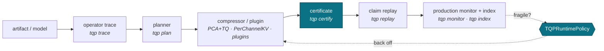

# TurboQuant Pro — documentation

> ✅ `tqp` and the certification platform ship in **1.8.0**, the current PyPI release — `pip install turboquant-pro` gives you the CLI used throughout these docs (add `[torch]` for `tqp trace`). See [`CLI.md`](CLI.md#install).

TurboQuant Pro is embedding and KV-cache compression built around one idea: **the
right way to compress a tensor is dictated by what its consumer does with it**, and
acceptance is measured on **that consumer's metric** — recall, a rank certificate,
perplexity, an expert-set flip rate — **never reconstruction cosine**, which is
repeatedly shown here to be blind or even anti-correlated with quality.

## Prove it works first (one command, CPU, seconds)

Before reading anything, reproduce the canonical retrieval result on **real public GloVe data**, with the recall floor **gated**:

```bash
tqp replay embedding_glove_recall     # gates recall@10 >= 0.95, compression >= 9.5x
```

~9.6× compression at recall@10 ≈ 0.999 (full corpus, rerank); the hermetic subset runs in CI. Acceptance is reranked recall, never reconstruction cosine. That is the whole thesis of this project in one command — everything below explains *why* it holds.

## New here? The 15-minute path

```
README quickstart  →  guides/user_guide.md  →  guides/certification.md  →  guides/claim_replay.md
```

1. Compress a corpus and search it — [**User guide**](guides/user_guide.md).
2. Prove the compression preserves ranking — [**Certification guide**](guides/certification.md).
3. Reproduce a headline number yourself — [**Claim replay guide**](guides/claim_replay.md).

## The pipeline



Every stage speaks the same acceptance language. The **runtime policy** closes the
loop: where an operator is fragile (a tied retrieval boundary, a tiny routing
margin, a slow SSM channel, a stale PCA basis) it escalates precision or reranking
instead of shipping a silent failure.

## Guides

| Guide | Read it to… |
|---|---|
| [User guide](guides/user_guide.md) | Compress embeddings safely and search them in 15 minutes. |
| [Operator-aware quantization](guides/operator_aware_quantization.md) | Understand why keys, values, gates, decays, and weights need different quotients. |
| [Certification](guides/certification.md) | Know what a TurboQuant Pro certificate means — and what it does not. |
| [Plugins](PLUGINS.md) | Write, test, and certify an out-of-tree quantizer plugin. |
| [Claim replay](guides/claim_replay.md) | Reproduce the headline numbers from `claims.yaml`. |
| [Production lifecycle](guides/production_lifecycle.md) | Maintain a mutable, compressed, drift-aware vector index. |

## Reference

| Doc | What it is |
|---|---|
| [CLI.md](CLI.md) | Every `tqp` command: trace, probe, plan, certify, replay, monitor, plugin, index. |
| [FORMATS.md](FORMATS.md) | **Formats at a glance** — TQE1, TQIX, plugin containers, and certificates side by side. |
| [CERTIFICATE_SPEC.md](CERTIFICATE_SPEC.md) | The provenance-stamped rank-certificate JSON schema + compatibility promise. |
| [FORMAT_SPEC.md](FORMAT_SPEC.md) | The TQE1 on-disk/wire record format (versioned). |
| [api-stability.md](api-stability.md) | Stable / Beta / Experimental tiers and optional-dependency extras. |
| [KV_KEYS_FINDING.md](KV_KEYS_FINDING.md) | The v1.2.0 keys catastrophe — the finding that motivates the whole thesis. |
| [claims.md](claims.md) | The evidence ladder (Track 1 embeddings, Track 2 KV). |
| [model_cards/](model_cards/) | Real-model operator validation: attention keys, MoE routing, SSM decay. |
| [soundness_audit.md](soundness_audit.md) | The tiered elegance-and-rigor audit (every finding fixed + verified). |
| [turboquant_pro_next_level_roadmap.md](turboquant_pro_next_level_roadmap.md) | Phase-by-phase roadmap and release sequence. |

## The one rule

Across every command, module, and guide: **the acceptance signal is rank fidelity
/ the (A2) consumer metric / a distribution-free certificate — never reconstruction
cosine on its own.** Cosine appears only as a labelled secondary diagnostic. This is
the coherence rule the whole project obeys; if you find a place that violates it,
that is a bug.
