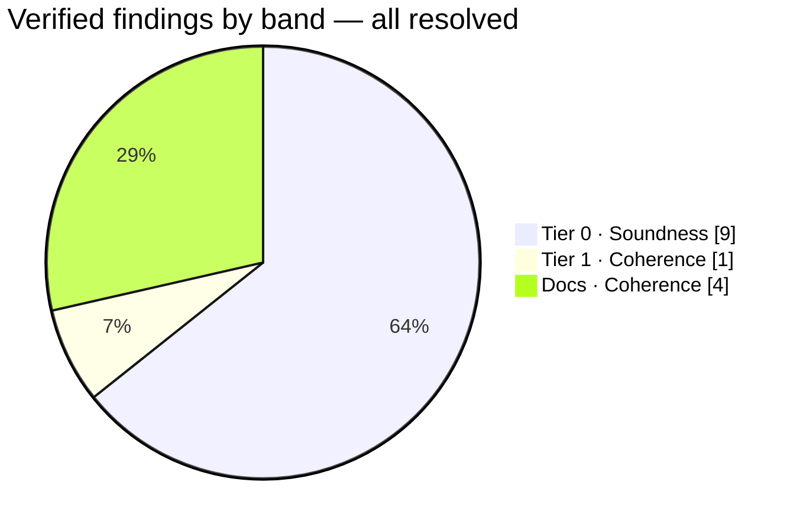
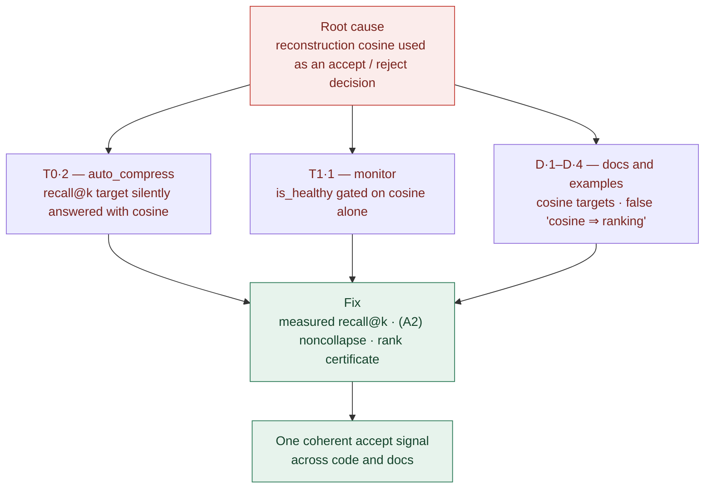
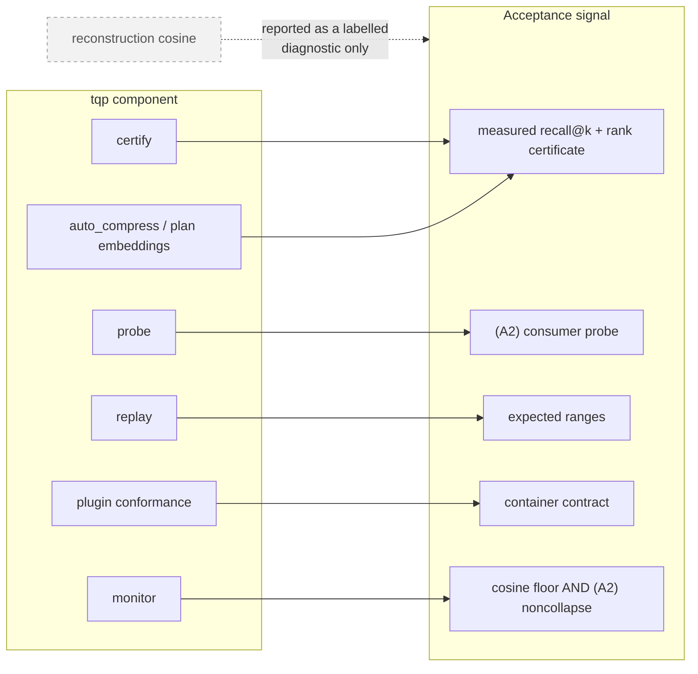
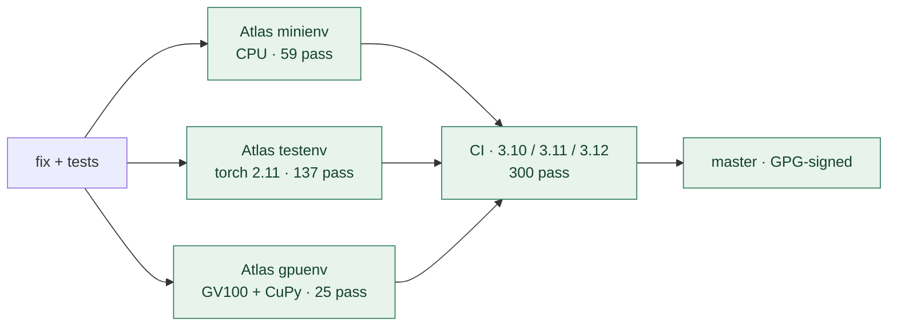

# Tiered Soundness Audit

A full elegance-and-rigor pass over the package surfaced defects where the code
**silently returns wrong results**, **crashes on supported inputs**, or **reports
a signal that contradicts the project's own acceptance-metric rule** — and a
follow-up sweep caught the same pattern in the docs. Findings are ranked by
consequence (soundness first) and each was verified against source before landing
here.

> This is the GitHub-rendered companion. A richer, self-contained standalone page
> is [`docs/soundness_audit.html`](soundness_audit.html) (download and open it —
> GitHub serves committed HTML as source).

| | |
|---|---|
| **Commit** | `554c09f` |
| **Date** | 2026-07-16 |
| **Tier 0** | 9 / 9 fixed |
| **Tier 1** | 1 / 1 fixed |
| **Docs** | 4 / 4 fixed |
| **CI (3.10–3.12)** | 300 passed |

---

## The thread through most of this audit

Three of the four coherence findings share one root cause: **reconstruction
cosine standing in for an acceptance decision.** Cosine can read ~0.97 while
retrieval ranking collapses (the v1.2.0 KV-keys incident: 0.095 reconstruction
error, perplexity ≈ 10⁴). It is a labelled diagnostic — never a gate.

After the fixes, every `tqp` component's accept signal is rank fidelity, the (A2)
consumer metric, or a distribution-free certificate — cosine appears only as a
guarded, labelled diagnostic.

---

## Tier 0 · Soundness — fixed

These produce a wrong answer with no error, or fail on inputs the API accepts.
All nine are fixed, tested, and verified on Atlas across the CPU, torch, and GPU
paths; the CUDA finding sat on the *default* GPU compress path and was invisible
to CI (it needs CuPy + a GPU).

| ID | Finding | Fix | ✓ |
|----|---------|-----|---|
| **T0·1** | **GPU fused rotate-quantize emitted garbage codes** (`cuda_kernels.py`). Each thread cached its own output column of `Pi_T` but read it as if indexed by the contraction variable → every output column got the same bogus diagonal sum. | Tile the input row into shared memory; contract against `Pi_T[:, out_col]`. GPU now matches CPU exactly. | 25/25 on GV100 (was 18 failing) |
| **T0·2** | **Acceptance metric silently aliased cosine** (`auto_compress._meets_target`). A `recall@k` target was answered with `mean_cosine` (marked `# approximate`). | Measure true `recall@k`; rank the Pareto frontier and fallback on the target's axis; **raise** on an unmeasured metric. | `TestRecallTarget` |
| **T0·3** | **TQE seed decoupled from its record → silent wrong decode** (`format.py`, `pgvector.py`). `pack(ce)` took `seed` as a free arg defaulting to 42, unrelated to the record → decode could rebuild a *different* rotation/codebook. | `CompressedEmbedding` carries `seed`; `pack` reads `ce.seed`; `unpack` returns it; both reject `bits ∉ {2,3,4}`. | v1 stays byte-identical |
| **T0·4** | **`ADCIndex.add()` silently dropped earlier batches** — assigned instead of appended, so `index.add(a).add(b)` kept only `b`. | Concatenate codes/norms across calls; incremental reproduces one-shot exactly. | `test_adc_index_add_accumulates` |
| **T0·5** | **`backend.to_numpy` crashed on bfloat16** — NumPy has no bf16 dtype, so `.numpy()` raised `TypeError`. | Lossless float32 upcast fallback. | — |
| **T0·6** | **Activation weight-compress crashed on non-square layers** (`model_compress`). It computed `W @ Vᵀ`, requiring `in == out` — never worked on the FFN matrices it targets. | Project output rows `Vkᵀ(Vk W)`; skip mismatched bases; honest "no size/latency win" docs. | `test_model_compress_shape` 2/2 |
| **T0·7** | **Rank-ratio denominator over-recommended compression** — divided `effective_rank` by `max(shape)` though it is bounded by `min(shape)`. | Divide by `min(shape)`, the true rank ceiling. | — |
| **T0·8** | **Plugin conformance passed subtly-wrong formats** — affine check (the fused-decode safety gate) used a flat `5e-3` tolerance; packed check passed vacuously when `packed=True` was ignored. | Scale-relative `max(1e-4, 1e-5·peak)`; packed must self-report or serialize distinctly. | in-tree plugins still pass; liar fails |
| **T0·9** | **`rank_certificate` over-claimed** — docstrings said "no distributional assumptions whatsoever," but the default robust `measure_kappa` (2.5/97.5 trim) is conditional on trimming ~5%. | Document the strict-vs-robust regimes honestly; defaults unchanged. | — |

---

## Tier 1 · Coherence — fixed

The numbers were correct, but a headline verdict rested on reconstruction cosine.

**T1·1 — The quality monitor's health verdict gated on cosine alone**
(`monitor.py`, `cli.py`). `is_healthy`, the alert, and the `tqp monitor` exit code
all reduced to `mean_cosine ≥ quality_floor`. The module *computed* the (A2)
tangential-fraction and radial-drift signals — its own docstring warns these catch
ranking damage "cosine cannot see" — but never wired them into the verdict, so a
stream whose tangential fraction collapsed still reported `is_healthy: true`.

**Fix (shipped):** health now also requires (A2) noncollapse — a self-calibrating
guard on downward tangential drift, plus an opt-in `tangential_floor`
(constructor + `tqp monitor --tangential-floor`) hard level gate. Both no-op when
the statistic is disabled or too sparse; alerts carry their triggering reasons.
6 new tests; Atlas monitor+cli 89 pass, CI 300 pass.

---

## Docs · Coherence — fixed

A follow-up sweep of every doc, example, and the CLI help/JSON the docs mirror,
for the same pattern in prose. Two of the four were *stale* — describing behavior
the T0·2 and T1·1 fixes had already changed.

| ID | Finding | Fix |
|----|---------|-----|
| **D·1** | Headline examples used a cosine acceptance target — README, `auto_compress` docstrings, and the `tqp plan embeddings` `--target` default all led with `target="cosine > 0.95"`. | All lead with `target="recall@10 >= 0.90"` (measured); the CLI default is now recall. `cosine`/`ratio` remain for reconstruction-only checks. |
| **D·2** | *Stale* "cosine/ratio search is a library limitation" note (`plan.json`, `docs/CLI.md`) — untrue after T0·2 taught `auto_compress` to measure `recall@k`. | Reworded: the frontier ranks on the target metric (measured recall when it is a recall target); acceptance is the rank-certificate preview; cosine is a diagnostic. |
| **D·3** | *Stale* monitor exit-code docs — "0 when mean cosine ≥ floor", the cosine-only gate T1·1 had just replaced. | Now: gate is `is_healthy` = cosine floor **and** (A2) noncollapse; `--tangential-floor` added to the signature. |
| **D·4** | False `cosine ⇒ ranking` equivalence (`turboquant-expansion-plan.md`): "0.978 mean cosine similarity means search ranking is almost perfectly preserved." | Corrected to call it a reconstruction diagnostic, not a ranking guarantee; points to measured `recall@k` / a rank certificate. |

### Reviewed and deliberately kept

Most cosine mentions are legitimate and were left untouched: benchmark-table
columns and per-bit fidelity descriptors ("5.1× at 0.978 cosine"), the
`min_cosine` / `mean_cosine` fields and Prometheus gauges, `certify --metric
cosine` (the ranking *distance*, gated on the τ floor) and `probe --consumer
cosine` (a consumer choice), and — importantly — the *correct* warnings that
cosine is not a recall proxy (README, the research notes, `KV_KEYS_FINDING.md`:
"reconstruction cosine stays deceptively high"). `CHANGELOG.md` is historical
record, left intact.

---

## How it was verified

Every fix was exercised on Atlas across the CPU, torch, and GPU paths, then on CI.
The CUDA finding was reproducible *only* with CuPy + a device, which is why it
outran CI's Python-only matrix.

### How the audit ran

Ten parallel readers swept the package by cluster, each returning ranked findings
with file:line, a concrete failure scenario, and a proposed fix. Every finding was
then re-read against current source by hand — nothing is reported on an agent's
word alone. A separate pass swept the docs and the CLI help/JSON they mirror.

### What this report does not claim

It consolidates the findings that survived verification at severity Tier 0–1 plus
the docs-coherence sweep. Lower-severity polish (style, micro-robustness) was not
elevated here, and the tree keeps moving — a fresh comprehensive sweep can
enumerate residual items on request rather than trusting a stale list.
