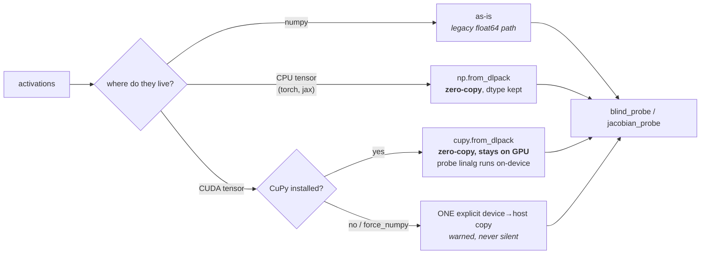

# tqp-readscope

[](https://pypi.org/project/tqp-readscope/)
[](../../LICENSE)

readscope-backed **read-operator providers** for turboquant-pro.

turboquant-pro has two extension points. `turboquant_pro.plugins` plugs in
**quantizers**, the things being certified. `turboquant_pro.read_operators`
plugs in the **read operator** `P_C` they are certified against, so that

```
D = tr(P_C @ Sigma_delta)
```

is a number you compute rather than a claim you make. This package supplies
`P_C` for consumers that have no closed form, by measuring it.

```python
from turboquant_pro.read_operators import (
    create_read_operator, consumer_distortion, error_covariance,
)

P = create_read_operator("readscope_jacobian", consumer=my_head).operator(keys)
sigma = error_covariance(keys, codec.decompress(codec.compress(keys)))
consumer_distortion(P, sigma)      # what the consumer actually loses
```

## Two providers

| name | consumer shape | recovers |
|---|---|---|
| `readscope_blind` | vector → scalar margin | `E[g gᵀ]` |
| `readscope_jacobian` | vector → vector | `E[Jᵀ J]` |

Prefer `readscope_jacobian` where the consumer emits a vector: each probe
direction then returns `m` numbers instead of one, at the same call cost.

## Install

```bash
pip install tqp-readscope                 # this bridge + readscope
pip install turboquant-pro[analysis]      # same thing, one meta-command
```

## Zero-copy ingestion (DLPack)

`operator(activations)` accepts numpy arrays and any DLPack producer —
torch, CuPy, JAX — and moves data as little as physics allows:



GPU→numpy zero-copy does not exist — numpy cannot address CUDA memory —
so the no-CuPy path makes exactly one named copy rather than hiding
per-call copies. On the CuPy path, readscope's backend-generic core runs
the pinv/QR/eigh where the data lives, and because every random probe
direction is drawn with numpy in the same order regardless of backend,
**a GPU reading and a CPU reading of the same seed are the same
reading.** Your consumer callable receives CuPy vectors on that path; a
torch consumer can accept them zero-copy via `torch.from_dlpack`.

## Modality-blind by construction

The consumer contract is "a callable on channel vectors"; every leading
axis — batch, sequence, ViT patch grid, audio frames — flattens into
operating points. No text assumption exists to outgrow: the ingestion
tests pin a `(B, H_patches, W_patches, d)` vision layout and an audio
frame stack to the identical path as token sequences, and a vision
attention consumer round-trips blind recovery with its read subspace
confined to span(queries) at the finite-difference floor.

## The budget is not a tuning knob

readscope's calibration found that recovery against the direction budget
`k/d` is a **cliff at `k = d`**, and that the cliff is **rank independent** —
asking for one direction costs the same as asking for sixteen, because below
full dimension the estimate is a projection onto a random subspace and a
projected operator's leading eigenvector is not the operator's.

So both providers default to `k = d` and **warn** when given less, rather
than quietly returning a one-direction reading that looks like a
measurement. Full specification, including what is still unmeasured:
[readscope SPEC.md](https://github.com/ahb-sjsu/readscope/blob/master/SPEC.md).

## Neither package depends on the other

turboquant-pro declares the protocol. readscope measures the operator. This
adapter is the only code that knows about both, and it is about a hundred
lines. readscope stays numpy-only and usable by people with no interest in
compression, which is worth more than the convenience of merging them.

## Install

```bash
pip install tqp-readscope
```

`readscope` comes with it. From a checkout, `pip install -e
plugins/tqp-readscope`.

Discovered automatically through the `turboquant_pro.read_operators` entry
point. MIT.
